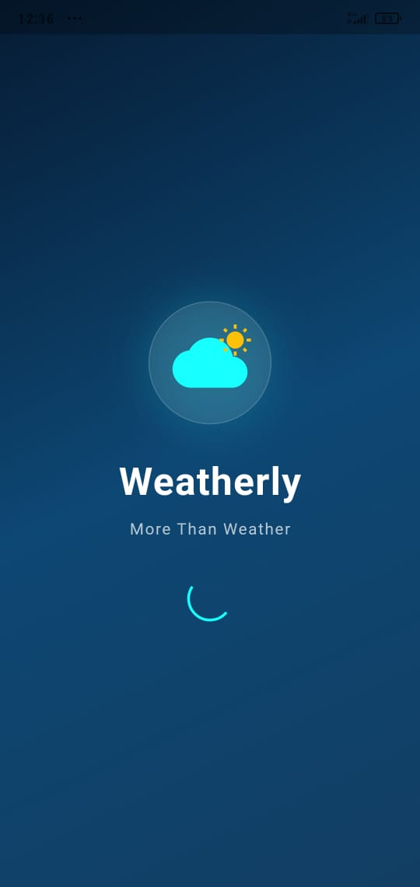
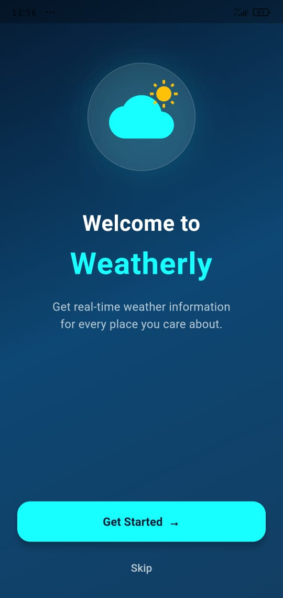
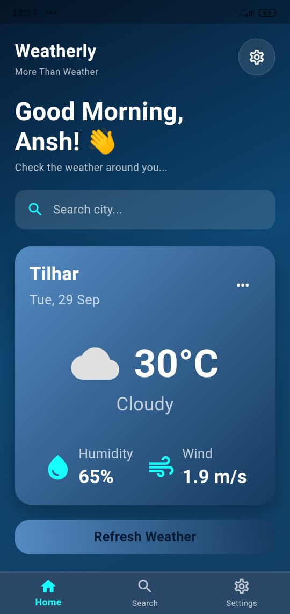
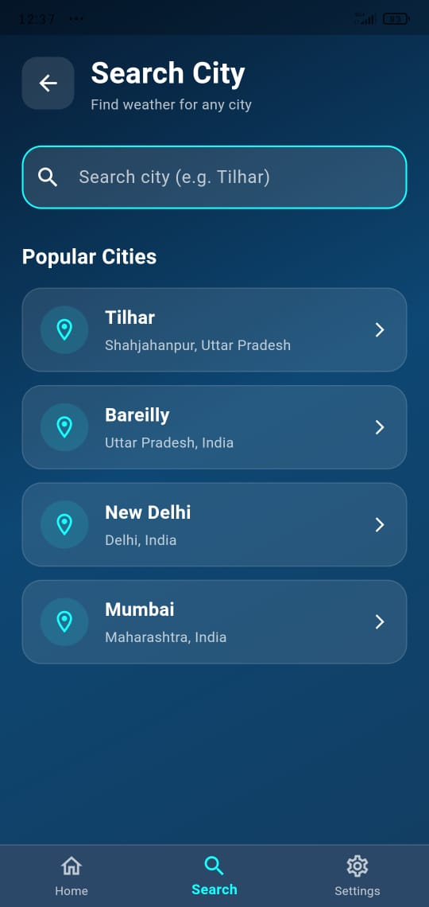
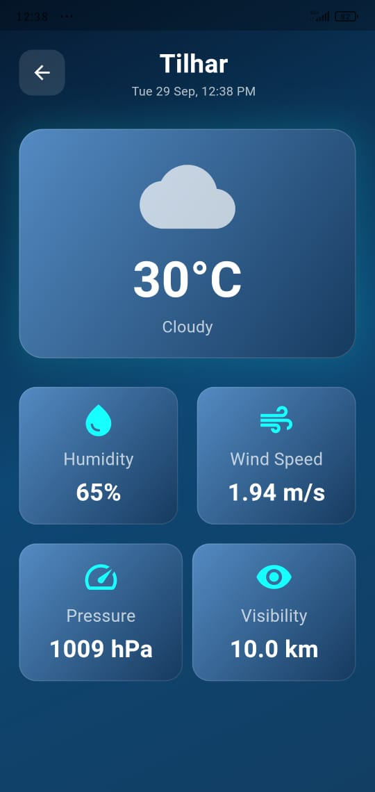
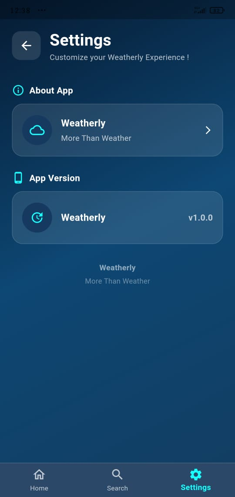
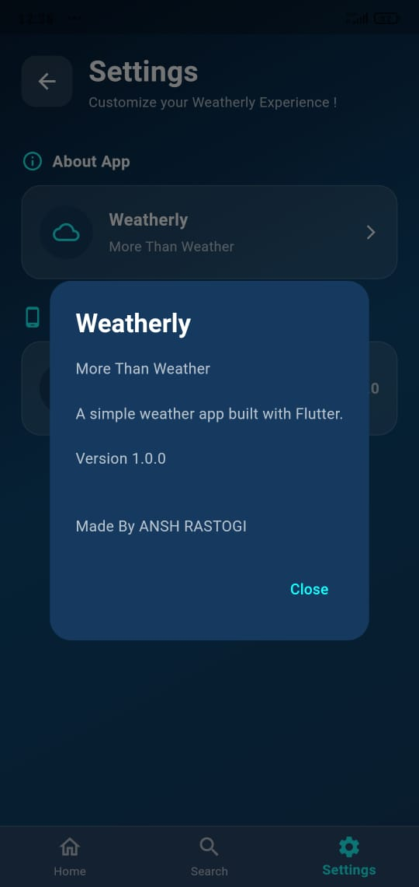
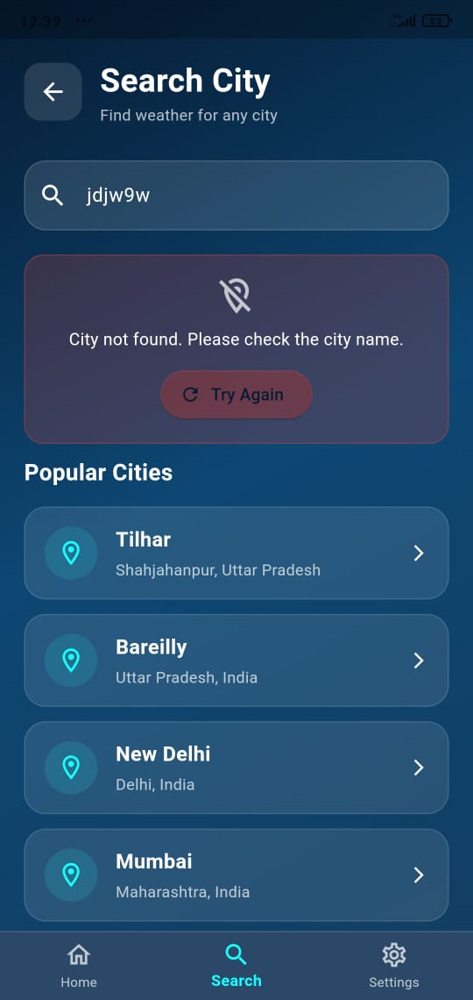

# 🌦️ Weatherly

> **More Than Weather**

A beginner-friendly Flutter weather application built to understand **real-world API integration, asynchronous programming, JSON parsing, state handling, navigation, reusable widgets, and Flutter project architecture**.

Weatherly fetches real-time weather information using the **OpenWeather API** and presents it through a clean dark-themed interface.

---

## 📱 About The Project

Weatherly is my **first Flutter API-based project**.

The goal of this project was not simply to create a weather application, but to understand how a Flutter application communicates with an external API and converts server data into a usable UI.

### 🔄 Core Flow

```text
User
  ↓
Flutter UI
  ↓
WeatherService
  ↓
OpenWeather API
  ↓
JSON Response
  ↓
WeatherModel
  ↓
Flutter UI
```

---

# ✨ Features

* 🌦️ Real-time weather data
* 🔍 Search weather by city
* 🏙️ Popular city shortcuts
* 🌡️ Temperature in Celsius
* 💧 Humidity
* 💨 Wind speed
* 🧭 Atmospheric pressure
* 👁️ Visibility
* 🌤️ Dynamic weather icons
* 📅 Dynamic date and time
* 🔄 Refresh current weather
* ⏳ Loading states
* ❌ Error handling
* 📱 Weather details screen
* ⚙️ Settings screen
* 🧭 Bottom navigation
* 🔙 Custom back navigation handling
* 🌙 Dark weather-themed UI
* 🔐 Environment-based API key configuration

---

## 🖼️ App Preview

> Screenshots of the Weatherly application.

### 🌅 Splash Screen



### 👋 Onboarding



### 🏠 Home



### 🔍 Search



### 🌤️ Weather Details



### ⚙️ Settings



### ℹ️ About Weatherly



### 💨 Error State



---

# 🛠️ Tech Stack

| Technology      | Purpose                                |
| --------------- | -------------------------------------- |
| Flutter         | Cross-platform application development |
| Dart            | Programming language                   |
| HTTP            | API requests                           |
| Flutter Dotenv  | Environment variable handling          |
| OpenWeather API | Weather data                           |
| Material UI     | Application interface                  |
| Git & GitHub    | Version control                        |

---

# 🏗️ Project Structure

```text
weatherly/
│
├── android/
├── ios/
├── web/
│
├── assets/
│   └── icons/
│
├── lib/
│   │
│   ├── main.dart
│   │
│   ├── models/
│   │   └── weather_model.dart
│   │
│   ├── navigation/
│   │   └── main_navigation.dart
│   │
│   ├── screens/
│   │   ├── home_screen.dart
│   │   ├── onboarding_screen.dart
│   │   ├── search_screen.dart
│   │   ├── setting_screen.dart
│   │   ├── splash_screen.dart
│   │   └── weather_details_screen.dart
│   │
│   ├── services/
│   │   └── weather_service.dart
│   │
│   ├── theme/
│   │   └── app_colors.dart
│   │
│   ├── utils/
│   │   └── constants.dart
│   │
│   └── widgets/
│       ├── weather_info_card.dart
│       └── weather_stat.dart
│
├── .env
├── .gitignore
├── pubspec.yaml
└── README.md
```

---

# 📂 Folder Responsibilities

## `lib/screens/`

Contains the main application screens.

```text
screens/
├── splash_screen.dart
├── onboarding_screen.dart
├── home_screen.dart
├── search_screen.dart
├── weather_details_screen.dart
└── setting_screen.dart
```

Each screen is responsible for its own UI and screen-specific behavior.

---

## `lib/navigation/`

Contains the application's main navigation logic.

```text
navigation/
└── main_navigation.dart
```

`MainNavigation` manages:

* Home
* Search
* Settings
* Bottom Navigation
* Selected weather data
* Back button behavior

### Navigation Index

```text
index = 0 → Home
index = 1 → Search
index = 2 → Settings
```

---

## `lib/models/`

Contains the application's data model.

```text
models/
└── weather_model.dart
```

### `WeatherModel`

Stores:

```text
cityName
temperature
humidity
windSpeed
condition
description
pressure
visibility
```

Using a model allows multiple weather values to be passed around as a single object.

---

## `lib/services/`

Contains API-related logic.

```text
services/
└── weather_service.dart
```

`WeatherService` handles:

```text
Creating API URL
       ↓
Sending HTTP GET request
       ↓
Receiving response
       ↓
Decoding JSON
       ↓
Extracting weather data
       ↓
Creating WeatherModel
```

The UI does not directly handle the HTTP request.

---

## `lib/widgets/`

Contains reusable UI components.

```text
widgets/
├── weather_info_card.dart
└── weather_stat.dart
```

These widgets are reused to display weather information such as:

* Humidity
* Wind
* Pressure
* Visibility

---

## `lib/theme/`

Contains application colors.

```text
theme/
└── app_colors.dart
```

The project uses a dark blue/cyan weather-inspired color system.

---

## `lib/utils/`

Contains reusable application constants.

```text
utils/
└── constants.dart
```

Examples:

```text
AppConstants.appName
AppConstants.tagline
AppConstants.defaultCity
```

---

# 🔄 Application Flow

```text
                         Weatherly
                            │
                            ↓
                     Splash Screen
                            │
                            ↓
                    Onboarding Screen
                            │
                            ↓
                     MainNavigation
                            │
              ┌─────────────┼─────────────┐
              ↓             ↓             ↓
            Home          Search       Settings
              │             │
              │             ↓
              │        Search City
              │             │
              │             ↓
              │       WeatherService
              │             │
              │             ↓
              │      OpenWeather API
              │             │
              │             ↓
              │       WeatherModel
              │             │
              └─────────────┴──────→ Home
```

---

# 🌐 API Architecture

Weatherly uses the **OpenWeather Current Weather API**.

### Request Flow

```text
getWeather("City")
       ↓
WeatherService
       ↓
http.get(url)
       ↓
OpenWeather API
       ↓
HTTP Response
       ↓
statusCode == 200
       ↓
jsonDecode(response.body)
       ↓
Weather Data
       ↓
WeatherModel
       ↓
Return to UI
```

---

# 📦 Weather Data Model

The API response is converted into a `WeatherModel`.

```dart
WeatherModel(
  cityName: cityName,
  temperature: temperature,
  humidity: humidity,
  windSpeed: windSpeed,
  condition: condition,
  description: description,
  pressure: pressure,
  visibility: visibility,
);
```

This keeps the UI code cleaner because the application works with one weather object instead of passing every value separately.

---

# 🔍 Search Flow

When a user searches for a city:

```text
User enters city
       ↓
searchCity()
       ↓
WeatherService
       ↓
OpenWeather API
       ↓
JSON response
       ↓
WeatherModel
       ↓
onCitySelected(result)
       ↓
MainNavigation
       ↓
selectedWeather
       ↓
HomeScreen
       ↓
Updated weather
```

The Search screen communicates with `MainNavigation` through a callback instead of directly controlling the Home screen.

---

# 🏠 Home Screen States

The Home screen handles three major states.

## ⏳ 1. Loading

```text
isLoading == true
        ↓
CircularProgressIndicator
        ↓
"Fetching weather..."
```

## ❌ 2. Error

```text
errorMessage != null
        ↓
Error UI
        ↓
Try Again
```

## ✅ 3. Success

```text
Weather successfully received
        ↓
WeatherModel
        ↓
Weather UI
```

---

# 🌦️ Dynamic Weather UI

Weatherly maps weather conditions to different icons.

```text
Clear         → ☀️
Clouds        → ☁️
Rain          → 💧
Drizzle       → 🌧️
Thunderstorm  → ⛈️
Snow          → ❄️
Mist/Fog/Haze → ☁️
```

The application also converts weather conditions into user-friendly text:

```text
Clear  → Clear Sky
Clouds → Cloudy
Rain   → Rainy
Snow   → Snowy
Mist   → Misty
```

---

# 🔙 Navigation Behavior

## Bottom Navigation

```text
Home
Search
Settings
```

These screens are controlled by `MainNavigation`.

## Weather Details

Weather Details is opened as a separate route:

```text
Home
 ↓
Weather Details
 ↓
Navigator.pop()
 ↓
Home
```

## 📱 Phone Back Button

When the user is on Search or Settings:

```text
Phone Back
    ↓
Home
```

When already on Home, normal back behavior is allowed.

---

# 🔐 API Key Setup

Weatherly uses a `.env` file for the OpenWeather API key.

Create a file named:

```text
.env
```

in the project root.

Add:

```env
OPENWEATHER_API_KEY=YOUR_API_KEY
```

The application loads the environment variables using:

```dart
await dotenv.load(fileName: '.env');
```

The API key is accessed through:

```dart
dotenv.env['OPENWEATHER_API_KEY']
```

### ⚠️ Important

**Never commit your real `.env` file to GitHub.**

Make sure `.env` is included in `.gitignore`.

---

# 🚀 Getting Started

## 1. Clone the Repository

```bash
git clone YOUR_REPOSITORY_URL
```

## 2. Open the Project

```bash
cd weatherly
```

## 3. Install Dependencies

```bash
flutter pub get
```

## 4. Create `.env`

```env
OPENWEATHER_API_KEY=YOUR_API_KEY
```

## 5. Run the Application

```bash
flutter run
```

---

# 📱 Build Release APK

To create a release APK:

```bash
flutter build apk --release
```

Generated APK:

```text
build/app/outputs/flutter-apk/app-release.apk
```

---

# 🧪 Error Handling

Weatherly handles common API errors:

| Status | Meaning           | App Response           |
| ------ | ----------------- | ---------------------- |
| `200`  | Success           | Weather displayed      |
| `401`  | Invalid API key   | Friendly service error |
| `404`  | City not found    | City not found message |
| `429`  | Too many requests | Try again later        |
| `500`  | Server error      | Server unavailable     |

The Search screen also provides a **Try Again** action when a request fails.

---

# 🧠 What I Learned

Building Weatherly helped me understand:

* Flutter screen architecture
* Widget composition
* Stateful widgets
* `setState()`
* `initState()`
* `didUpdateWidget()`
* `dispose()`
* Navigation
* Bottom Navigation
* Callback functions
* `Future`
* `async` / `await`
* HTTP GET requests
* REST API basics
* JSON parsing
* Data models
* API error handling
* Loading and error states
* Environment variables
* Reusable widgets
* Git/GitHub workflow
* Release APK generation

---

# 📚 Documentation

More detailed technical documentation can be maintained inside the `docs/` folder.

```text
docs/
├── how-weatherly-works.md
├── app-flow.md
├── api-integration.md
├── project-structure.md
├── setup.md
└── screenshots/
```

---

# 🎯 Project Goals

Weatherly was created as a **learning project** with a focus on understanding the fundamentals behind a real Flutter API application.

The architecture is intentionally kept simple so that the core concepts remain easy to understand.

---

# 🚧 Future Improvements

Possible future improvements:

* 📍 Location-based weather
* 🌡️ Celsius / Fahrenheit switching
* 📅 Multi-day weather forecast
* 🌙 More theme options
* 🌐 More detailed weather information
* 💾 Recent searched cities
* 🔔 Weather alerts
* 📊 Weather charts

---

# 👨‍💻 Developer

## Ansh Rastogi

**Flutter Developer in Progress 🚀**

Currently learning:

```text
Dart
  ↓
Flutter
  ↓
REST APIs
  ↓
Firebase
  ↓
Production Apps
```

---

# 🌦️ Weatherly

> **More Than Weather**

Built with **Flutter 💙**

---

## ⭐ Learning Milestone

Weatherly is an important milestone in my Flutter journey because it was my first project where I moved beyond static UI and worked with a **real external API, asynchronous operations, JSON data, models, navigation, loading states, and error handling**.
