# 🌐 Weatherly — API Integration

> **More Than Weather**

This document explains how Weatherly communicates with the OpenWeather API.

It covers the complete journey of weather data:

```text
Flutter App
    ↓
WeatherService
    ↓
HTTP GET Request
    ↓
OpenWeather API
    ↓
JSON Response
    ↓
jsonDecode()
    ↓
Weather Data
    ↓
WeatherModel
    ↓
Flutter UI
```

The goal of this document is to make the API integration understandable enough that a developer can recreate the same flow from scratch.

---

# 1. 🧠 What Is an API?

API stands for:

```text
Application Programming Interface
```

In Weatherly, the API acts as a bridge between the Flutter application and the weather server.

Instead of storing weather information inside the application, Weatherly asks an external server for the latest weather information.

```text
Weatherly
    ↓
"Give me weather for Mumbai"
    ↓
OpenWeather API
    ↓
"Here is Mumbai's weather"
    ↓
Weatherly
```

---

# 2. 🌐 Weatherly API

Weatherly uses:

```text
OpenWeather API
```

The application requests current weather information for a city.

The request contains:

```text
City name
API key
Units
```

Conceptually:

```text
Weatherly
   ↓
City + API Key + Units
   ↓
OpenWeather API
   ↓
Current Weather
```

---

# 3. 🏗️ API Architecture

The API architecture is intentionally simple.

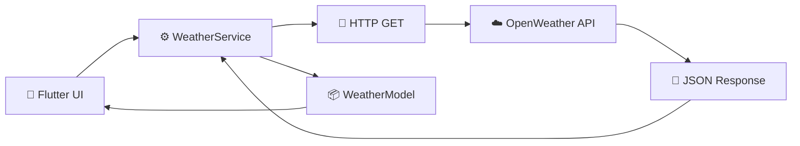

The UI does not directly handle the HTTP request.

Instead:

```text
Screen
  ↓
WeatherService
  ↓
API
```

---

# 4. 📁 Where API Code Lives

The API logic is located in:

```text
lib/
└── services/
    └── weather_service.dart
```

This file contains:

```dart
class WeatherService {
  Future<WeatherModel> getWeather(String city) async {
    ...
  }
}
```

The main function is:

```text
getWeather()
```

---

# 5. 🎯 Responsibility of WeatherService

`WeatherService` is responsible for:

```text
1. Getting the API key
2. Creating the API URL
3. Sending HTTP GET request
4. Receiving the response
5. Checking status code
6. Decoding JSON
7. Extracting weather values
8. Creating WeatherModel
9. Returning WeatherModel
10. Throwing errors when request fails
```

The complete flow:

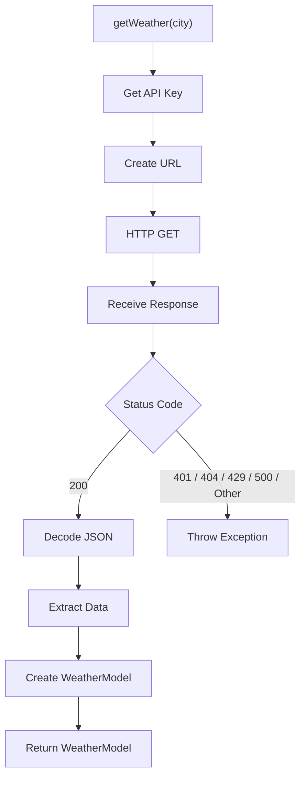

---

# 6. 🔐 API Key

Weatherly uses an API key to communicate with OpenWeather.

The key is stored in:

```text
.env
```

Example:

```text
OPENWEATHER_API_KEY=YOUR_API_KEY
```

The real API key should never be written directly into source code.

---

# 7. 📦 `flutter_dotenv`

Weatherly uses:

```text
flutter_dotenv
```

to load the `.env` file.

The dependency is added through:

```bash
flutter pub add flutter_dotenv
```

The application loads the file in `main.dart`.

```dart
await dotenv.load(fileName: '.env');
```

---

# 8. 🚀 Loading Environment Variables

The application starts with:

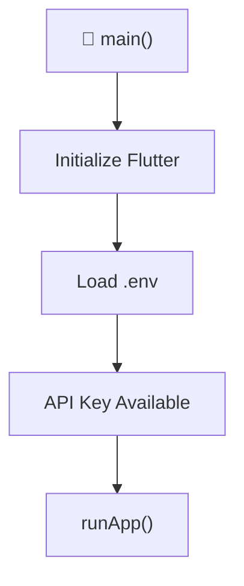

The important line is:

```dart
await dotenv.load(fileName: '.env');
```

After this, WeatherService can access:

```dart
dotenv.env['OPENWEATHER_API_KEY']
```

---

# 9. 🔑 Getting the API Key

Inside WeatherService:

```dart
final apiKey = dotenv.env['OPENWEATHER_API_KEY'];
```

Conceptually:

```text
.env
 ↓
OPENWEATHER_API_KEY
 ↓
dotenv
 ↓
WeatherService
```

---

# 10. 🔗 Creating the API URL

WeatherService creates the request URL using:

```text
City
API Key
Units
```

Conceptually:

```text
https://api.openweathermap.org/data/2.5/weather
        ?q=CITY
        &appid=API_KEY
        &units=metric
```

For example:

```text
getWeather("Tilhar")
```

creates a request for Tilhar.

---

# 11. 📌 Query Parameters

The API request contains three important parameters.

## `q`

Represents the city.

```text
q=Mumbai
```

---

## `appid`

Represents the OpenWeather API key.

```text
appid=YOUR_API_KEY
```

---

## `units`

Controls the unit system.

Weatherly uses:

```text
units=metric
```

This allows the application to work with metric weather values.

---

# 12. 📡 HTTP GET Request

Weatherly uses the `http` package.

Dependency:

```bash
flutter pub add http
```

The actual request is:

```dart
final response = await http.get(url);
```

This means:

```text
Send GET request
       ↓
Wait for server
       ↓
Receive HTTP response
```

---

# 13. 🔄 HTTP Request Flow

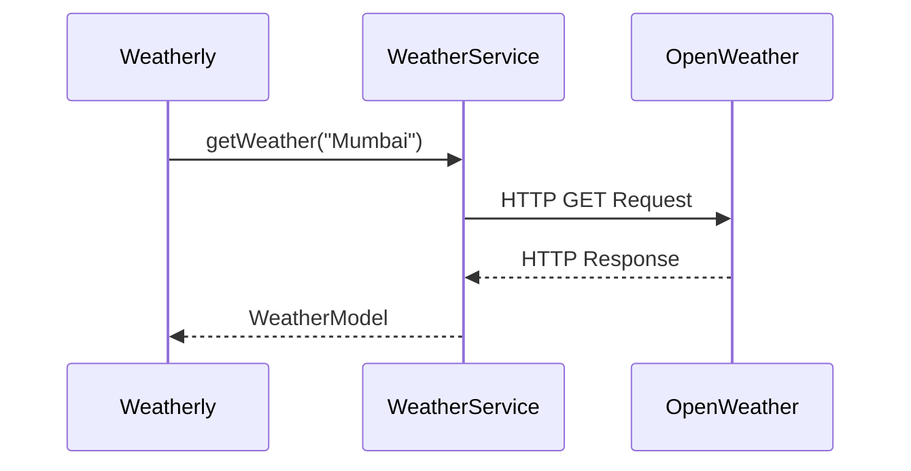

---

# 14. ⏳ Why `async`?

Network communication takes time.

The application cannot know exactly when the server will respond.

Therefore:

```dart
Future<WeatherModel> getWeather(String city) async
```

is asynchronous.

The function returns:

```text
Future<WeatherModel>
```

This means:

> A WeatherModel will be available in the future.

---

# 15. ⏸️ Why `await`?

The HTTP request is:

```dart
await http.get(url);
```

`await` means:

```text
Start request
     ↓
Wait for response
     ↓
Continue execution
```

Without waiting for the response, the application would try to use data that has not arrived yet.

---

# 16. 📡 Complete Request

The complete request looks like:

```text
getWeather("Mumbai")
        ↓
Create URL
        ↓
http.get(url)
        ↓
OpenWeather Server
        ↓
Response
```

Mermaid:

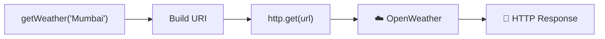

---

# 17. 📊 HTTP Status Code

After receiving the response:

```dart
response.statusCode
```

is checked.

Weatherly handles these responses:

| Status Code | Meaning |
|---|---|
| `200` | Request successful |
| `401` | Invalid API key |
| `404` | City not found |
| `429` | Too many requests |
| `500` | Weather server error |

---

# 18. ✅ Status Code `200`

If:

```dart
response.statusCode == 200
```

the request was successful.

The response body contains weather data.

The application then runs:

```dart
final data = jsonDecode(response.body);
```

Flow:

```text
200
 ↓
response.body
 ↓
jsonDecode()
 ↓
data
```

---

# 19. ❌ Status Code `404`

If:

```text
404
```

Weatherly throws:

```dart
throw Exception('City not found');
```

Example:

```text
User enters invalid city
        ↓
API
        ↓
404
        ↓
City not found
        ↓
Exception
        ↓
Error UI
```

---

# 20. 🔐 Status Code `401`

If:

```text
401
```

Weatherly throws:

```dart
throw Exception('Invalid API key');
```

This can happen when the API key is invalid or not accepted by the API.

---

# 21. 🚦 Status Code `429`

If:

```text
429
```

Weatherly throws:

```dart
throw Exception('Too many requests');
```

This represents a request limit situation.

---

# 22. 🖥️ Status Code `500`

If:

```text
500
```

Weatherly throws:

```dart
throw Exception('Weather server error');
```

This represents a server-side error.

---

# 23. ❓ Other Status Codes

If the response is not one of the handled codes:

```dart
throw Exception('Unable to fetch weather');
```

This provides a generic fallback error.

---

# 24. 🧩 JSON Response

A successful weather API response contains structured JSON data.

Conceptually:

```json
{
  "name": "Mumbai",
  "main": {
    "temp": 30.5,
    "humidity": 70,
    "pressure": 1008
  },
  "wind": {
    "speed": 4.2
  },
  "weather": [
    {
      "main": "Clouds",
      "description": "scattered clouds"
    }
  ],
  "visibility": 10000
}
```

The actual API response may contain additional fields.

Weatherly only extracts the fields required by the application.

---

# 25. 🔄 JSON → Dart

JSON is not directly used throughout the UI.

First:

```dart
jsonDecode(response.body)
```

converts the JSON response into Dart data.

Flow:


---

# 26. 🧩 Extracting City Name

Weatherly extracts the city name using:

```dart
data['name']
```

Flow:

```text
JSON
 ↓
data['name']
 ↓
cityName
```

---

# 27. 🌡️ Extracting Temperature

Temperature is inside:

```text
main
```

So Weatherly accesses:

```dart
data['main']['temp']
```

Flow:

```text
data
 ↓
main
 ↓
temp
 ↓
Temperature
```

---

# 28. 💧 Extracting Humidity

Humidity is accessed using:

```dart
data['main']['humidity']
```

Flow:

```text
data
 ↓
main
 ↓
humidity
 ↓
Humidity
```

---

# 29. 💨 Extracting Wind Speed

Wind speed is inside:

```text
wind
```

Weatherly accesses:

```dart
data['wind']['speed']
```

Flow:

```text
data
 ↓
wind
 ↓
speed
 ↓
Wind Speed
```

---

# 30. 🌦️ Extracting Weather Condition

Weather information is returned as an array.

Weatherly accesses the first weather item:

```dart
data['weather'][0]['main']
```

This gives the main weather condition.

Example:

```text
Clear
Clouds
Rain
Snow
Thunderstorm
```

---

# 31. 📝 Extracting Description

The weather description is:

```dart
data['weather'][0]['description']
```

Example:

```text
clear sky
scattered clouds
light rain
```

---

# 32. 🧭 Extracting Pressure

Pressure is extracted using:

```dart
data['main']['pressure']
```

This value is stored in the WeatherModel.

---

# 33. 👁️ Extracting Visibility

The API visibility value is converted from meters to kilometers.

Weatherly performs:

```text
visibility / 1000
```

Example:

```text
10000 meters
     ↓
10 kilometers
```

---

# 34. 📦 WeatherModel

After extracting the required values, WeatherService creates:

```text
WeatherModel
```

The model contains:

```text
cityName
temperature
humidity
windSpeed
condition
description
pressure
visibility
```

Architecture:

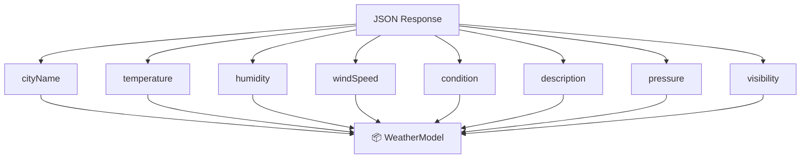

---

# 35. 🎯 Why Use a Model?

Without a model, every value would need to be passed separately.

For example:

```text
cityName
temperature
humidity
windSpeed
condition
pressure
visibility
```

Instead, Weatherly creates:

```text
WeatherModel
```

and passes one object.

```text
SearchScreen
      ↓
WeatherModel
      ↓
MainNavigation
      ↓
HomeScreen
```

---

# 36. 🔄 Complete API Data Pipeline

This is the most important diagram in the file:

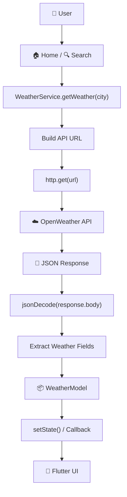

---

# 37. 🔁 Home API Flow

When Home needs weather:

```text
HomeScreen
      ↓
loadWeather(city)
      ↓
WeatherService
      ↓
getWeather(city)
      ↓
OpenWeather API
      ↓
WeatherModel
      ↓
weather = result
      ↓
UI update
```

Mermaid:

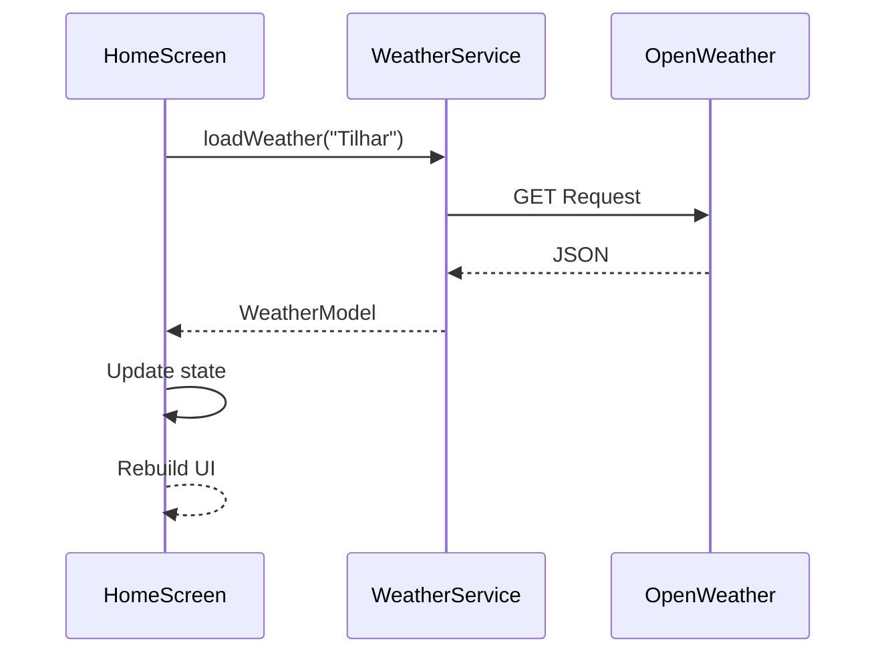

---

# 38. 🔍 Search API Flow

When SearchScreen searches a city:

```text
SearchScreen
      ↓
searchCity(city)
      ↓
WeatherService
      ↓
OpenWeather API
      ↓
JSON
      ↓
WeatherModel
      ↓
onCitySelected()
      ↓
MainNavigation
      ↓
Home
```

Mermaid:

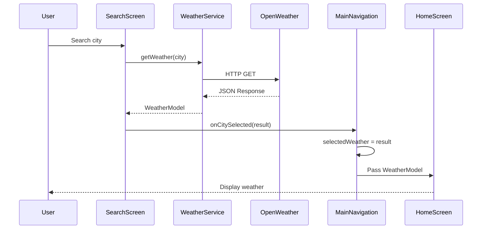

---

# 39. 🔄 Refresh API Flow

Refresh uses the same service.

```text
User taps Refresh
       ↓
loadWeather(currentCity)
       ↓
WeatherService
       ↓
API
       ↓
Fresh JSON
       ↓
WeatherModel
       ↓
UI
```

The important point is:

> Refresh does not require a separate API implementation.

It reuses:

```text
WeatherService.getWeather()
```

---

# 40. ⏳ API Loading State

API requests take time.

Therefore the UI uses:

```text
isLoading
```

Flow:

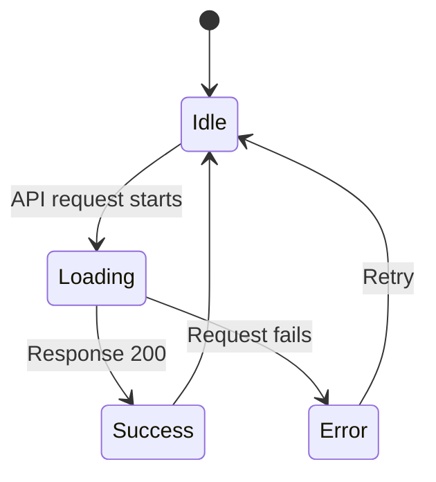

---

# 41. ❌ API Error Flow

Weatherly converts API failures into exceptions.

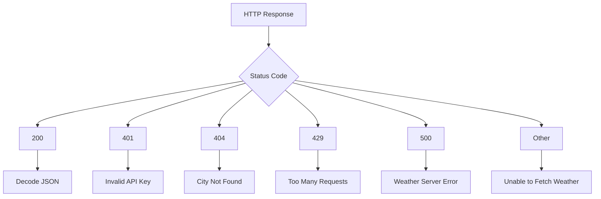

---

# 42. 🛡️ Exception Handling

WeatherService uses:

```dart
try {
   ...
} catch (e) {
   rethrow;
}
```

The service rethrows the error.

This allows the calling screen to handle the error.

Conceptually:

```text
WeatherService
      ↓
Exception
      ↓
rethrow
      ↓
HomeScreen / SearchScreen
      ↓
Error UI
```

---

# 43. 🔄 Why Re-Throw the Error?

The service knows:

```text
What went wrong
```

The screen knows:

```text
How to show the error to the user
```

Therefore:

```text
WeatherService
→ Detects / throws error

Screen
→ Displays error
```

This keeps responsibilities separated.

---

# 44. 🧱 Responsibility Separation

Weatherly follows this simple separation:

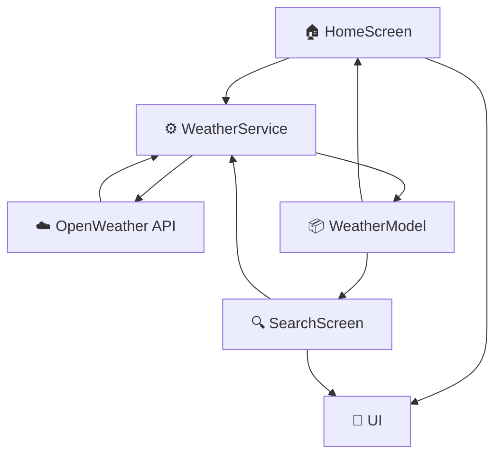

### HomeScreen

Displays weather.

### SearchScreen

Searches for a city.

### WeatherService

Communicates with the API.

### WeatherModel

Stores weather data.

### OpenWeather API

Provides weather data.

---

# 45. 🧠 API Integration In Simple Words

The complete process can be remembered as:

```text
1. User asks for weather
        ↓
2. WeatherService creates request
        ↓
3. HTTP GET is sent
        ↓
4. OpenWeather responds
        ↓
5. JSON is received
        ↓
6. jsonDecode() reads JSON
        ↓
7. Required fields are extracted
        ↓
8. WeatherModel is created
        ↓
9. Model goes back to screen
        ↓
10. UI displays weather
```

---

# 46. 🧪 Example: Mumbai

Suppose the user searches:

```text
Mumbai
```

The complete flow becomes:

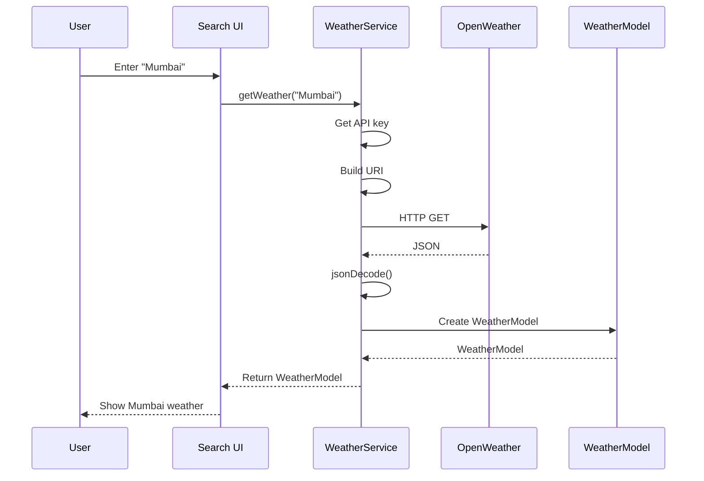

---

# 47. 🔍 JSON Field Mapping

Weatherly maps API fields to model fields like this:

| API Field | WeatherModel Field | Purpose |
|---|---|---|
| `name` | `cityName` | City name |
| `main.temp` | `temperature` | Temperature |
| `main.humidity` | `humidity` | Humidity |
| `wind.speed` | `windSpeed` | Wind speed |
| `weather[0].main` | `condition` | Main condition |
| `weather[0].description` | `description` | Condition description |
| `main.pressure` | `pressure` | Atmospheric pressure |
| `visibility` | `visibility` | Visibility |

---

# 48. 📦 Model Creation

After mapping:

```text
API JSON
   ↓
Field extraction
   ↓
WeatherModel
```

Conceptually:

```dart
WeatherModel(
  cityName: cityName,
  temperature: temperature,
  humidity: humidity,
  windSpeed: windSpeed,
  condition: condition,
  description: description,
  pressure: pressure,
  visibility: visibility,
);
```

Then:

```text
return WeatherModel
```

---

# 49. 🔄 Future<WeatherModel>

The method:

```dart
Future<WeatherModel> getWeather(String city)
```

can be understood as:

```text
Future
  ↓
A result that will arrive later
  ↓
WeatherModel
```

So:

```text
Future<WeatherModel>
```

means:

> A WeatherModel will be returned asynchronously.

---

# 50. 🌐 API Integration Architecture

The complete architecture is:

```text
                  WEATHERLY
                      │
                      ↓
                 User Action
                      │
             ┌────────┴────────┐
             ↓                 ↓
          Home             Search
             │                 │
             └────────┬────────┘
                      ↓
                WeatherService
                      │
                      ↓
                 API Request
                      │
                      ↓
             OpenWeather API
                      │
                      ↓
                 JSON Response
                      │
                      ↓
                 jsonDecode()
                      │
                      ↓
                Extract Fields
                      │
                      ↓
                 WeatherModel
                      │
                      ↓
                    UI
```

---

# 51. 🔐 API Key Security

The `.env` approach keeps the API key out of normal source-code files and helps prevent accidentally committing it to Git.

The project should keep:

```text
.env
```

inside:

```text
.gitignore
```

Example:

```text
.env
```

### Important

An API key included in a mobile application is not a perfect secret once the application is distributed.

For a beginner project, `.env` is useful for keeping the key out of GitHub source code.

For a production application, API key restrictions and a suitable backend/security strategy should also be considered.

---

# 52. ⚠️ Common API Mistakes

## Mistake 1 — Wrong API Key

```text
401
Invalid API key
```

Check:

```text
.env
OPENWEATHER_API_KEY
```

---

## Mistake 2 — Forgetting `.env`

If `.env` is not loaded:

```text
dotenv.env['OPENWEATHER_API_KEY']
```

will not provide the expected key.

---

## Mistake 3 — Forgetting `await`

Wrong:

```dart
http.get(url);
```

when the code immediately needs the response.

Correct:

```dart
await http.get(url);
```

---

## Mistake 4 — Wrong JSON Path

For example:

```text
data['temperature']
```

would not match the structure used by Weatherly.

Temperature is nested under:

```text
data['main']['temp']
```

---

## Mistake 5 — Treating JSON Like a Model

JSON data is raw API data.

Weatherly first extracts the required values and then creates:

```text
WeatherModel
```

---

## Mistake 6 — Not Handling Errors

A network request can fail.

Possible reasons include:

```text
Invalid API key
City not found
Too many requests
Server error
Network problem
```

The UI therefore needs loading and error states.

---

# 53. 🧠 API Concepts Learned

Building Weatherly's API integration teaches:

```text
API
REST API
HTTP
GET Request
URI
Query Parameters
HTTP Status Codes
JSON
jsonDecode()
Future
async
await
Exception
try / catch
Models
Environment Variables
API Error Handling
```

---

# 54. 🎯 Scratch-to-API Learning Path

A developer wanting to learn this from scratch can follow:

```text
1. Understand APIs
        ↓
2. Understand HTTP
        ↓
3. Learn GET request
        ↓
4. Learn URI / URL
        ↓
5. Learn query parameters
        ↓
6. Send request using http package
        ↓
7. Read response.statusCode
        ↓
8. Read response.body
        ↓
9. Understand JSON
        ↓
10. Learn jsonDecode()
        ↓
11. Extract JSON fields
        ↓
12. Create Dart Model
        ↓
13. Return Model from Service
        ↓
14. Use Model in UI
        ↓
15. Add Loading State
        ↓
16. Add Error Handling
```

---

# 55. 🏆 Weatherly API Pattern

The core pattern used by Weatherly is:

```text
SCREEN
   ↓
SERVICE
   ↓
HTTP
   ↓
API
   ↓
JSON
   ↓
MODEL
   ↓
SCREEN
```

This pattern can be reused for many other Flutter applications.

For example:

```text
Weather App
    ↓
Weather API

News App
    ↓
News API

Movie App
    ↓
Movie API

Crypto App
    ↓
Crypto API

Food App
    ↓
Food API
```

---

# 🌟 Final Takeaway

Weatherly's API integration is built around one simple idea:

> **The screen asks the service for data. The service talks to the API. The API returns JSON. The service converts that data into a WeatherModel. The screen displays the model.**

In one diagram:

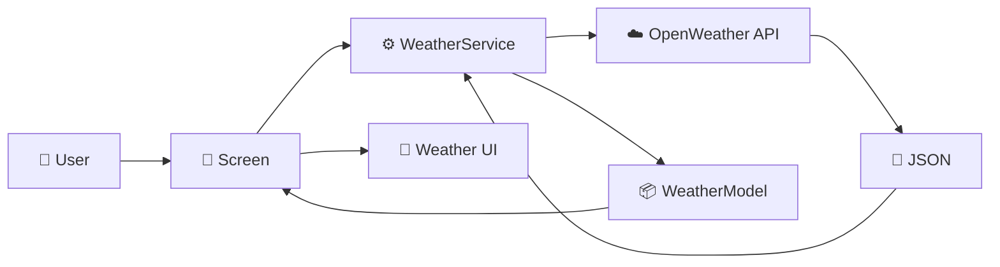

---

## 🌦️ Weatherly

> **More Than Weather**

Built with Flutter 💙