# 🧭 Weatherly — App Flow

> **More Than Weather**

This document explains how users move through Weatherly and how different screens communicate with each other.

The goal is to make the application's navigation and user flow easy to understand before looking at the actual code.

---

# 📱 1. Complete Application Flow

The complete Weatherly journey is:

```text
App Launch
    ↓
Splash Screen
    ↓
Onboarding Screen
    ↓
Main Navigation
    ↓
┌───────────────┬───────────────┬───────────────┐
│               │               │
Home          Search          Settings
│               │
│               ↓
│          Search City
│               ↓
│        WeatherService
│               ↓
│        OpenWeather API
│               ↓
│         WeatherModel
│               ↓
│        MainNavigation
│               ↓
│             Home
│
└───────────────┘
```

---

# 🌊 2. High-Level Mermaid Flow

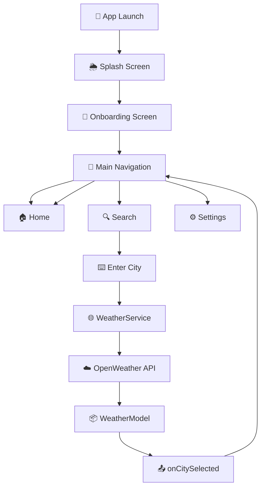

---

# 🚀 3. Application Startup Flow

When Weatherly starts, the first screen is the Splash Screen.

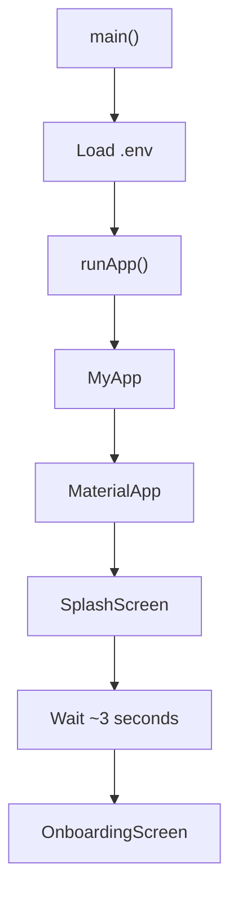

The startup sequence is:

```text
main()
 ↓
WidgetsFlutterBinding.ensureInitialized()
 ↓
Load .env
 ↓
runApp()
 ↓
MyApp
 ↓
MaterialApp
 ↓
SplashScreen
```

---

# 🌦️ 4. Splash Screen Flow

The Splash Screen introduces the Weatherly branding.

After approximately 3 seconds:

```text
SplashScreen
      ↓
Future.delayed()
      ↓
Navigator.pushReplacement()
      ↓
OnboardingScreen
```

Mermaid representation:

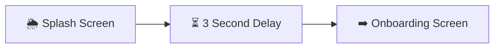

### Why `pushReplacement()`?

The Splash Screen should not appear again when the user presses Back.

```text
Splash
  ↓
Onboarding

Back
  ↓
Splash should NOT reopen
```

Therefore:

```dart
Navigator.pushReplacement(...)
```

is used.

---

# 👋 5. Onboarding Flow

The Onboarding Screen gives the user two choices:

```text
Get Started
Skip
```

Both lead to the main application.

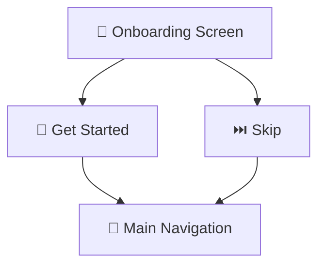

The navigation is:

```text
Onboarding
    ↓
Get Started / Skip
    ↓
MainNavigation
```

---

# 🧭 6. Main Navigation

`MainNavigation` controls the application's three primary tabs:

```text
Home
Search
Settings
```

The tab index is:

```text
0 → Home
1 → Search
2 → Settings
```

Mermaid:

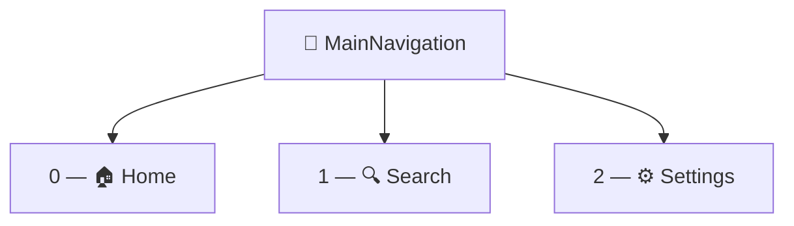

---

# 🔢 7. Bottom Navigation Flow

The user can switch tabs using the Bottom Navigation Bar.

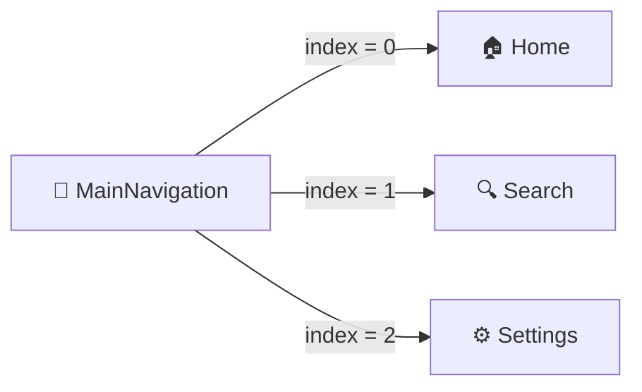

For example:

```text
User taps Search
       ↓
index = 1
       ↓
SearchScreen
```

And:

```text
User taps Home
       ↓
index = 0
       ↓
HomeScreen
```

---

# 🏠 8. Home Screen Flow

Home is the primary weather screen.

When Home opens, it checks whether weather data has already been provided.

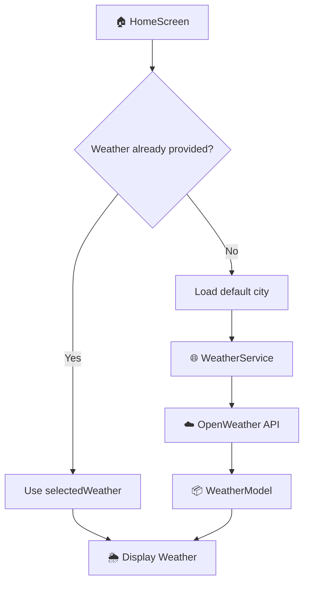

The default city is:

```text
Tilhar
```

---

# 🏠 9. First Home Load

If no `selectedWeather` is available:

```text
HomeScreen
    ↓
initState()
    ↓
selectedWeather == null
    ↓
loadWeather("Tilhar")
    ↓
WeatherService
    ↓
OpenWeather API
    ↓
WeatherModel
    ↓
Home UI
```

Mermaid:

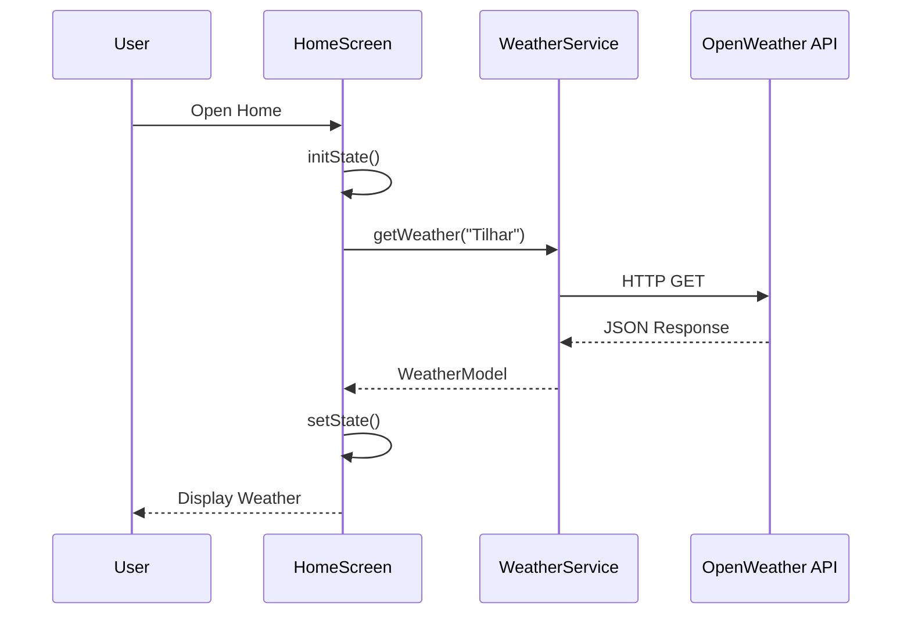

---

# 🔍 10. Search Screen Flow

SearchScreen allows the user to search for a city.

Basic flow:

```text
Search Screen
      ↓
User enters city
      ↓
searchCity()
      ↓
WeatherService
      ↓
OpenWeather API
      ↓
WeatherModel
      ↓
onCitySelected()
      ↓
MainNavigation
      ↓
Home
```

Mermaid:

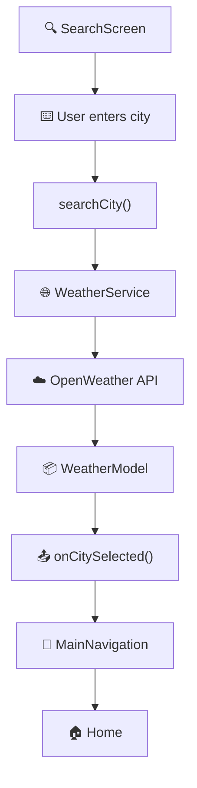

---

# 🏙️ 11. Searching a City

Example:

```text
User searches:

Mumbai
```

The flow becomes:

```text
"Mumbai"
    ↓
TextField
    ↓
searchCity("Mumbai")
    ↓
WeatherService.getWeather("Mumbai")
    ↓
OpenWeather API
    ↓
JSON
    ↓
WeatherModel
```

Mermaid:

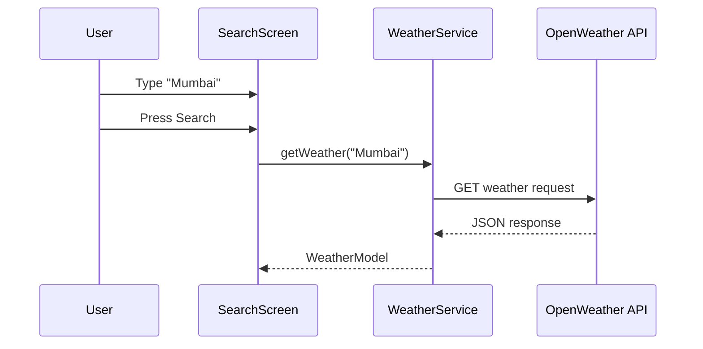

---

# 📤 12. Search Result → Home

SearchScreen does not directly control HomeScreen.

Instead it uses:

```text
onCitySelected()
```

The flow is:

```text
SearchScreen
      ↓
onCitySelected(result)
      ↓
MainNavigation
      ↓
selectedWeather = result
      ↓
index = 0
      ↓
HomeScreen
```

Mermaid:

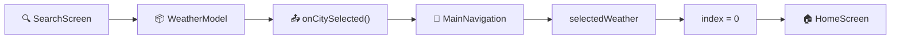

---

# 📦 13. What `selectedWeather` Does

`selectedWeather` temporarily stores the weather received from SearchScreen.

Example:

```text
User searches Mumbai
        ↓
Mumbai WeatherModel
        ↓
selectedWeather
```

So:

```text
selectedWeather
        ↓
Mumbai weather data
```

This allows MainNavigation to pass the searched weather to HomeScreen.

---

# 🔄 14. Complete Search-to-Home Sequence

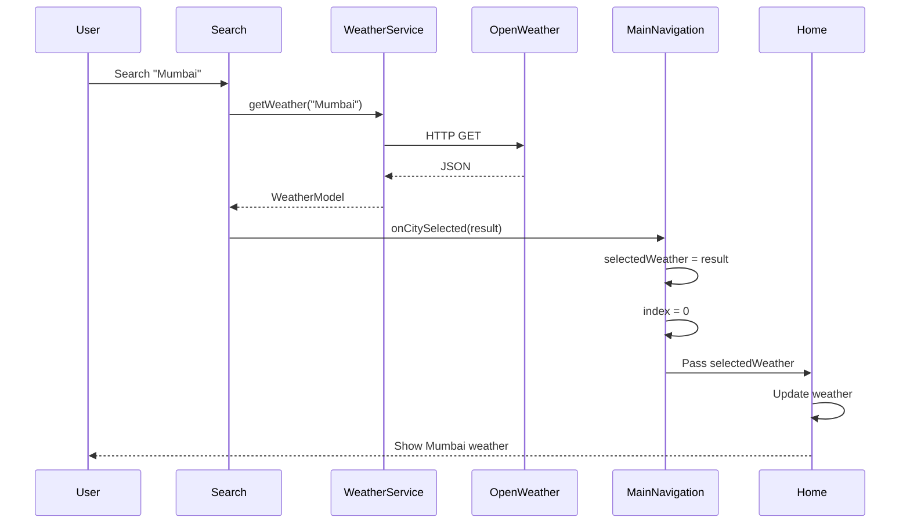

---

# ❌ 15. Invalid City Flow

If the user enters a city that the API cannot find:

```text
User enters invalid city
        ↓
searchCity()
        ↓
WeatherService
        ↓
OpenWeather API
        ↓
404
        ↓
Exception
        ↓
catch()
        ↓
errorMessage
        ↓
Error UI
```

Mermaid:

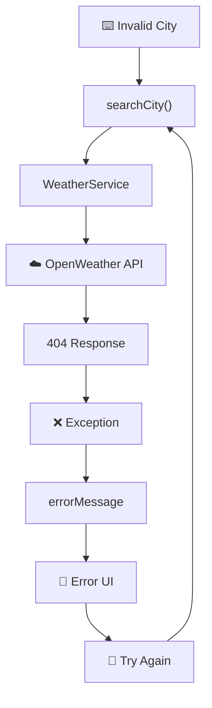

The Search Screen remains open.

The user can search another city without leaving the screen.

---

# ⏳ 16. Search Loading Flow

When the search starts:

```text
isLoading = true
```

The UI displays a loading indicator.

After the API responds:

```text
isLoading = false
```

Then the UI displays either the result or an error.

Mermaid:

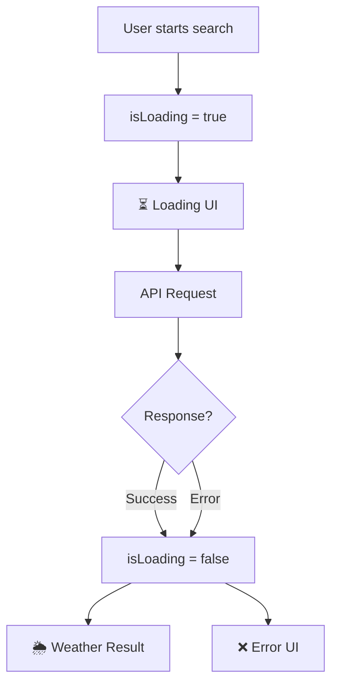

---

# 🏙️ 17. Popular City Flow

Weatherly also provides popular city cards.

Current popular cities include:

```text
Tilhar
Bareilly
New Delhi
Mumbai
```

When the user taps a city:

```text
Popular City
      ↓
cityController.text = cityName
      ↓
searchCity(cityName)
      ↓
WeatherService
      ↓
OpenWeather API
      ↓
WeatherModel
      ↓
onCitySelected()
      ↓
MainNavigation
      ↓
Home
```

Mermaid:

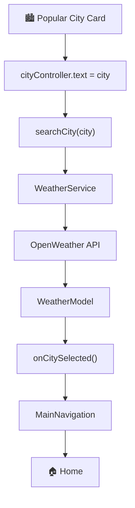

---

# 🔄 18. Refresh Weather Flow

The Home Screen allows the user to refresh the current city's weather.

```text
User taps Refresh
       ↓
loadWeather(currentCity)
       ↓
WeatherService
       ↓
OpenWeather API
       ↓
Fresh WeatherModel
       ↓
setState()
       ↓
Updated UI
```

Mermaid:

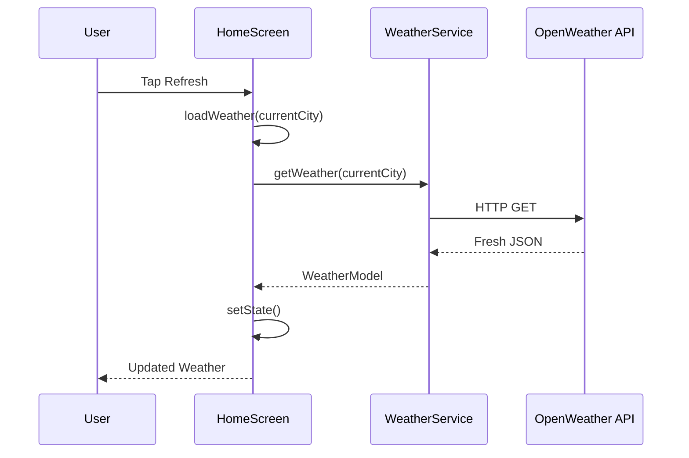

---

# 🌦️ 19. Weather Details Flow

Weather Details is different from the three bottom-navigation tabs.

It is opened as a separate route.

```text
Home
 ↓
Weather Details
 ↓
WeatherModel
 ↓
Details UI
```

Mermaid:

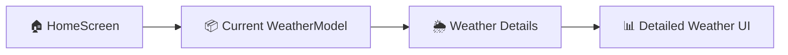

---

# 🔙 20. Weather Details Back Flow

When the user presses Back from Weather Details:

```text
Weather Details
      ↓
Navigator.pop()
      ↓
Home
```

Mermaid:

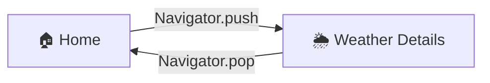

---

# ⚙️ 21. Settings Flow

Settings is a bottom-navigation tab.

```text
MainNavigation
      ↓
index = 2
      ↓
SettingsScreen
```

Mermaid:

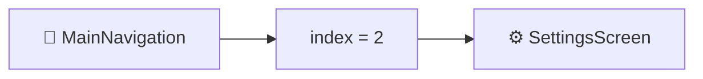

The Settings Screen currently provides application information such as:

```text
About Weatherly
App Version
Weatherly
More Than Weather
```

---

# 🔙 22. Search Back Flow

Search is a bottom-navigation tab, so returning to Home is handled through the navigation state.

```text
Search
  ↓
onBack
  ↓
index = 0
  ↓
Home
```

Mermaid:

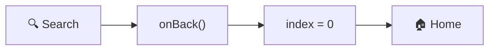

---

# 🔙 23. Settings Back Flow

Settings follows the same pattern:

```text
Settings
    ↓
onBack
    ↓
index = 0
    ↓
Home
```

Mermaid:

```mermaid
flowchart LR

    A["⚙️ Settings"]
    B["onBack()"]
    C["index = 0"]
    D["🏠 Home"]

    A --> B --> C --> D
```

---

# 📱 24. Phone Back Button Behavior

The main navigation also handles the Android phone Back button.

If the current tab is Search or Settings:

```text
Phone Back
    ↓
Current tab != Home
    ↓
index = 0
    ↓
Home
```

If the current tab is already Home:

```text
Phone Back
    ↓
Current tab == Home
    ↓
Allow system back behavior
```

Mermaid:

```mermaid
flowchart TD

    A["📱 Phone Back Button"]
    B{"Current tab?"}

    C["🔍 Search / ⚙️ Settings"]
    D["🏠 Home"]

    E["index = 0"]
    F["System Back"]

    A --> B

    B -->|Search / Settings| C
    C --> E
    E --> D

    B -->|Home| F
```

---

# 🧭 25. Complete Navigation Map

```mermaid
flowchart TD

    A["🌦️ Splash"] --> B["👋 Onboarding"]
    B --> C["🧭 MainNavigation"]

    C --> D["🏠 Home"]
    C --> E["🔍 Search"]
    C --> F["⚙️ Settings"]

    E --> G["⌨️ Search City"]
    G --> H["🌐 WeatherService"]
    H --> I["☁️ OpenWeather API"]
    I --> J["📦 WeatherModel"]
    J --> K["📤 onCitySelected"]
    K --> C

    D --> L["🌦️ Weather Details"]
    L --> D
```

---

# 🌐 26. Complete Data + Navigation Flow

The most important flow in Weatherly combines navigation and data:

```mermaid
flowchart TD

    A["👤 User"] --> B["🔍 SearchScreen"]

    B --> C["searchCity()"]

    C --> D["🌐 WeatherService"]

    D --> E["☁️ OpenWeather API"]

    E --> F["📄 JSON Response"]

    F --> G["jsonDecode()"]

    G --> H["📦 WeatherModel"]

    H --> I["📤 onCitySelected()"]

    I --> J["🧭 MainNavigation"]

    J --> K["selectedWeather"]

    K --> L["🏠 HomeScreen"]

    L --> M["🌦️ Weather UI"]
```

---

# 🧠 27. State Flow

Weatherly mainly uses simple Flutter state management through `setState()`.

The basic pattern is:

```text
User Action
    ↓
Function
    ↓
Change State
    ↓
setState()
    ↓
Widget rebuilds
    ↓
Updated UI
```

For example:

```text
Search
 ↓
isLoading = true
 ↓
setState()
 ↓
Loading UI
 ↓
API response
 ↓
weather = result
 ↓
isLoading = false
 ↓
setState()
 ↓
Weather UI
```

Mermaid:

```mermaid
flowchart TD

    A["👤 User Action"]
    B["⚙️ Function"]
    C["🔄 Change State"]
    D["setState()"]
    E["🔨 Widget Rebuild"]
    F["🎨 Updated UI"]

    A --> B --> C --> D --> E --> F
```

---

# 🔁 28. Weather Data Lifecycle

A weather object follows this lifecycle:

```text
API
 ↓
JSON
 ↓
WeatherModel
 ↓
SearchScreen
 ↓
MainNavigation
 ↓
selectedWeather
 ↓
HomeScreen
 ↓
weather
 ↓
UI
```

Mermaid:

```mermaid
flowchart LR

    A["☁️ API"]
    B["📄 JSON"]
    C["📦 WeatherModel"]
    D["🔍 SearchScreen"]
    E["🧭 MainNavigation"]
    F["selectedWeather"]
    G["🏠 HomeScreen"]
    H["weather"]
    I["🌦️ UI"]

    A --> B --> C --> D --> E --> F --> G --> H --> I
```

---

# 🧩 29. Main User Journey

A normal user journey looks like this:

```text
1. Open Weatherly
        ↓
2. Splash Screen
        ↓
3. Onboarding
        ↓
4. Get Started / Skip
        ↓
5. Home
        ↓
6. See current weather
        ↓
7. Open Search
        ↓
8. Search a city
        ↓
9. Wait for API response
        ↓
10. Weather result received
        ↓
11. Return to Home
        ↓
12. New city's weather displayed
        ↓
13. Open Weather Details if needed
        ↓
14. Return to Home
```

---

# 🎯 30. One-Page Flow Summary

```mermaid
flowchart TD

    START(["🚀 Start Weatherly"])

    SPLASH["🌦️ Splash"]
    ONBOARD["👋 Onboarding"]
    NAV["🧭 MainNavigation"]

    HOME["🏠 Home"]
    SEARCH["🔍 Search"]
    SETTINGS["⚙️ Settings"]

    INPUT["⌨️ City Input"]
    SERVICE["🌐 WeatherService"]
    API["☁️ OpenWeather API"]
    JSON["📄 JSON"]
    MODEL["📦 WeatherModel"]
    CALLBACK["📤 onCitySelected"]
    SELECTED["selectedWeather"]

    DETAILS["🌦️ Weather Details"]

    START --> SPLASH
    SPLASH --> ONBOARD
    ONBOARD --> NAV

    NAV --> HOME
    NAV --> SEARCH
    NAV --> SETTINGS

    SEARCH --> INPUT
    INPUT --> SERVICE
    SERVICE --> API
    API --> JSON
    JSON --> MODEL
    MODEL --> CALLBACK
    CALLBACK --> NAV

    NAV --> SELECTED
    SELECTED --> HOME

    HOME --> DETAILS
    DETAILS --> HOME
```

---

# 📚 31. Flow Cheat Sheet

| Action | Flow |
|---|---|
| App starts | `main → Splash` |
| Splash finishes | `Splash → Onboarding` |
| Get Started | `Onboarding → MainNavigation` |
| Skip | `Onboarding → MainNavigation` |
| Open Home | `index = 0` |
| Open Search | `index = 1` |
| Open Settings | `index = 2` |
| Search city | `Search → WeatherService → API` |
| Search success | `API → WeatherModel → onCitySelected` |
| Send weather to Home | `MainNavigation → selectedWeather → Home` |
| Refresh | `Home → WeatherService → API → Home` |
| Open Details | `Home → Weather Details` |
| Close Details | `Weather Details → Navigator.pop() → Home` |
| Search Back | `Search → index = 0 → Home` |
| Settings Back | `Settings → index = 0 → Home` |
| Invalid city | `API → Exception → errorMessage → Error UI` |

---

# 🧠 32. Important Concept

Weatherly uses two different navigation ideas.

## Bottom Navigation

Used for the main sections:

```text
Home
Search
Settings
```

Controlled using:

```text
index
```

---

## Route Navigation

Used for screens such as:

```text
Weather Details
```

Controlled using:

```text
Navigator.push()
Navigator.pop()
```

This distinction is important when understanding the project.

---

# 🌦️ Final Flow

The complete Weatherly architecture can be remembered as:

```text
                    WEATHERLY
                        │
                        ↓
                     Splash
                        │
                        ↓
                   Onboarding
                        │
                        ↓
                MainNavigation
                        │
          ┌─────────────┼─────────────┐
          ↓             ↓             ↓
        Home          Search        Settings
          │             │
          │             ↓
          │        Search City
          │             │
          │             ↓
          │       WeatherService
          │             │
          │             ↓
          │      OpenWeather API
          │             │
          │             ↓
          │        WeatherModel
          │             │
          │             ↓
          │       onCitySelected
          │             │
          │             ↓
          └──── MainNavigation
                        │
                        ↓
                      Home
                        │
                        ↓
                 Weather Details
```

---

# 🌟 Final Takeaway

The main application flow can be reduced to four ideas:

```text
NAVIGATION
    ↓
USER ACTION
    ↓
API REQUEST
    ↓
DATA → UI
```

Or more specifically:

```text
User
 ↓
Screen
 ↓
Function
 ↓
WeatherService
 ↓
API
 ↓
WeatherModel
 ↓
MainNavigation
 ↓
Screen
 ↓
UI
```

Once this flow is understood, the rest of the Weatherly code becomes much easier to follow.

---

## 🌦️ Weatherly

> **More Than Weather**

Built with Flutter 💙