# 📂 Weatherly — Project Structure

> **More Than Weather**

This document explains the internal structure of the Weatherly Flutter application.

The purpose of this document is to answer:

- Where is each part of the application located?
- What does each folder do?
- What does each Dart file do?
- Which files communicate with each other?
- Where should a new developer make changes?
- How does data move through the project?

---

# 1. 🌦️ Project Overview

Weatherly is organized into small, responsibility-based folders.

The main application code lives inside:

```text
lib/
```

The project follows this general structure:

```text
lib/
│
├── main.dart
│
├── models/
│   └── weather_model.dart
│
├── navigation/
│   └── main_navigation.dart
│
├── screens/
│   ├── splash_screen.dart
│   ├── onboarding_screen.dart
│   ├── home_screen.dart
│   ├── search_screen.dart
│   ├── weather_details_screen.dart
│   └── setting_screen.dart
│
├── services/
│   └── weather_service.dart
│
├── theme/
│   └── app_colors.dart
│
├── utils/
│   └── constants.dart
│
└── widgets/
    ├── weather_info_card.dart
    └── weather_stat.dart
```

---

# 2. 🗂️ Complete Project Tree

The important project structure is:

```text
weatherly/
│
├── android/
├── assets/
│   └── icons/
│       └── weatherly_icon.png
│
├── build/
│
├── docs/
│   ├── how-weatherly-works.md
│   ├── app-flow.md
│   ├── api-integration.md
│   ├── project-structure.md
│   ├── setup.md
│   └── screenshots/
│
├── lib/
│   │
│   ├── main.dart
│   │
│   ├── models/
│   │   └── weather_model.dart
│   │
│   ├── navigation/
│   │   └── main_navigation.dart
│   │
│   ├── screens/
│   │   ├── splash_screen.dart
│   │   ├── onboarding_screen.dart
│   │   ├── home_screen.dart
│   │   ├── search_screen.dart
│   │   ├── weather_details_screen.dart
│   │   └── setting_screen.dart
│   │
│   ├── services/
│   │   └── weather_service.dart
│   │
│   ├── theme/
│   │   └── app_colors.dart
│   │
│   ├── utils/
│   │   └── constants.dart
│   │
│   └── widgets/
│       ├── weather_info_card.dart
│       └── weather_stat.dart
│
├── .env
├── .gitignore
├── pubspec.yaml
└── README.md
```

---

# 3. 🧭 High-Level Architecture

Weatherly can be understood using these layers:

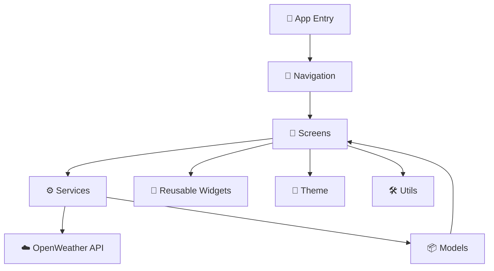

---

# 4. 🚀 `main.dart`

Location:

```text
lib/main.dart
```

This is the entry point of the Flutter application.

Its main responsibilities are:

```text
1. Initialize Flutter
2. Load environment variables
3. Start the application
4. Configure MaterialApp
5. Open SplashScreen
```

Flow:

```text
main()
   ↓
WidgetsFlutterBinding
   ↓
Load .env
   ↓
runApp()
   ↓
MyApp
   ↓
MaterialApp
   ↓
SplashScreen
```

Mermaid:

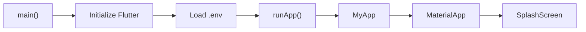

---

# 5. 🧭 `navigation/`

Folder:

```text
lib/navigation/
```

Current file:

```text
main_navigation.dart
```

The Navigation layer connects the major screens of the application.

---

# 6. 🧭 `main_navigation.dart`

Location:

```text
lib/navigation/main_navigation.dart
```

`MainNavigation` acts as the central navigation controller for the main application.

It manages:

```text
Home
Search
Settings
```

The current indexes are:

```text
0 → Home
1 → Search
2 → Settings
```

---

# 7. 🔢 Navigation Index Map

```text
index
 │
 ├── 0 → 🏠 HomeScreen
 │
 ├── 1 → 🔍 SearchScreen
 │
 └── 2 → ⚙️ SettingsScreen
```

Mermaid:

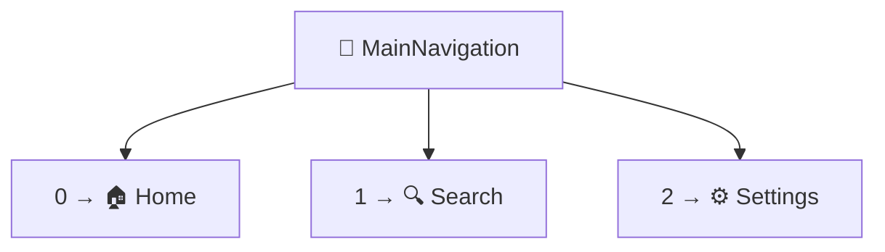

---

# 8. 🔗 MainNavigation Responsibilities

`MainNavigation` connects the screens.

For example:

```text
SearchScreen
      ↓
onCitySelected()
      ↓
MainNavigation
      ↓
selectedWeather
      ↓
HomeScreen
```

It also connects:

```text
Home → Search
Home → Settings
Search → Home
Settings → Home
```

---

# 9. 📱 `screens/`

Folder:

```text
lib/screens/
```

This folder contains the application's major screens.

Current screens:

```text
splash_screen.dart
onboarding_screen.dart
home_screen.dart
search_screen.dart
weather_details_screen.dart
setting_screen.dart
```

---

# 10. 🌦️ Screen Responsibility Map

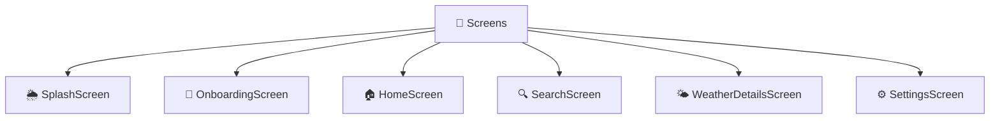

---

# 11. 🌦️ `splash_screen.dart`

Location:

```text
lib/screens/splash_screen.dart
```

Purpose:

```text
Display Weatherly branding
        ↓
Wait for a short duration
        ↓
Navigate to Onboarding
```

Main responsibilities:

- Display Weatherly logo/icon
- Display application name
- Display tagline
- Display loading indicator
- Navigate to Onboarding

Flow:

```text
SplashScreen
      ↓
Delay
      ↓
OnboardingScreen
```

---

# 12. 👋 `onboarding_screen.dart`

Location:

```text
lib/screens/onboarding_screen.dart
```

Purpose:

Introduce Weatherly before entering the main application.

The screen provides:

```text
Get Started
Skip
```

Both actions lead to:

```text
MainNavigation
```

Flow:

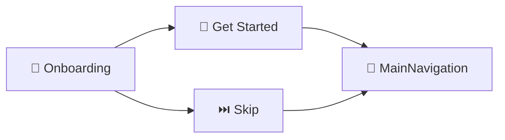

---

# 13. 🏠 `home_screen.dart`

Location:

```text
lib/screens/home_screen.dart
```

This is the primary weather screen.

Responsibilities include:

```text
Display weather
Fetch default city weather
Display loading state
Display error state
Refresh weather
Display current city
Open Search
Open Settings
Open Weather Details
```

The Home Screen works with:

```text
WeatherService
WeatherModel
MainNavigation
AppColors
AppConstants
Reusable Widgets
```

---

# 14. 🏠 HomeScreen Dependency Map

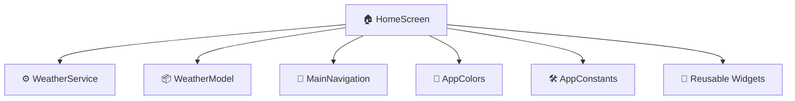

---

# 15. 🔍 `search_screen.dart`

Location:

```text
lib/screens/search_screen.dart
```

Purpose:

Allow users to search weather by city.

Responsibilities:

```text
1. Accept city input
2. Start weather search
3. Show loading state
4. Call WeatherService
5. Handle errors
6. Return WeatherModel
7. Send result to MainNavigation
```

Flow:

```text
User
 ↓
Search TextField
 ↓
searchCity()
 ↓
WeatherService
 ↓
WeatherModel
 ↓
onCitySelected()
 ↓
MainNavigation
 ↓
Home
```

---

# 16. 🔍 SearchScreen Dependency Map

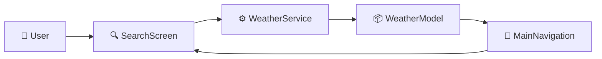

---

# 17. 🌤️ `weather_details_screen.dart`

Location:

```text
lib/screens/weather_details_screen.dart
```

Purpose:

Display additional weather information for the currently selected city.

The screen works with weather data such as:

```text
Temperature
Condition
Humidity
Wind
Pressure
Visibility
Description
```

It receives weather information and displays it in a more detailed layout.

---

# 18. ⚙️ `setting_screen.dart`

Location:

```text
lib/screens/setting_screen.dart
```

Purpose:

Provide application-related settings and information.

Current functionality includes:

```text
About Weatherly
App version
Application information
Footer branding
```

It is accessed through:

```text
MainNavigation
```

---

# 19. ⚙️ Settings Navigation

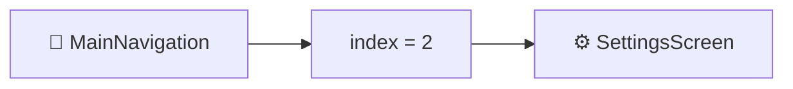

---

# 20. ⚙️ `services/`

Folder:

```text
lib/services/
```

Current file:

```text
weather_service.dart
```

The service layer handles communication with external services.

In Weatherly, the main external service is:

```text
OpenWeather API
```

---

# 21. 🌐 `weather_service.dart`

Location:

```text
lib/services/weather_service.dart
```

This is the main API communication file.

Its main function is:

```dart
getWeather(String city)
```

It:

```text
Builds API URL
      ↓
Sends HTTP GET
      ↓
Receives response
      ↓
Checks status code
      ↓
Decodes JSON
      ↓
Extracts weather data
      ↓
Creates WeatherModel
      ↓
Returns WeatherModel
```

---

# 22. 🌐 Service Architecture

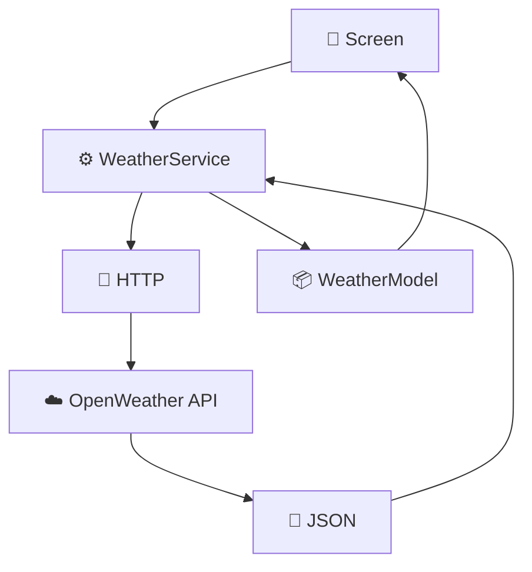

---

# 23. 📦 `models/`

Folder:

```text
lib/models/
```

Current file:

```text
weather_model.dart
```

Models represent structured application data.

---

# 24. 📦 `weather_model.dart`

Location:

```text
lib/models/weather_model.dart
```

`WeatherModel` stores weather information in one object.

Current fields:

```text
cityName
temperature
humidity
windSpeed
condition
description
pressure
visibility
```

Structure:

```text
WeatherModel
│
├── cityName
├── temperature
├── humidity
├── windSpeed
├── condition
├── description
├── pressure
└── visibility
```

---

# 25. 📦 Why WeatherModel Exists

Instead of passing individual values everywhere:

```text
cityName
temperature
humidity
windSpeed
condition
...
```

Weatherly can pass:

```text
WeatherModel
```

as one object.

Example:

```text
SearchScreen
      ↓
WeatherModel
      ↓
MainNavigation
      ↓
HomeScreen
```

---

# 26. 📦 Model Data Flow

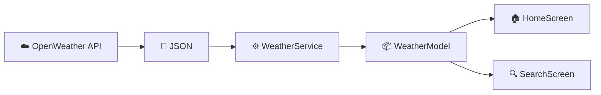

---

# 27. 🎨 `theme/`

Folder:

```text
lib/theme/
```

Current file:

```text
app_colors.dart
```

This folder contains reusable visual values.

---

# 28. 🎨 `app_colors.dart`

Location:

```text
lib/theme/app_colors.dart
```

Purpose:

Centralize application colors.

Examples include:

```text
background
gradientBlue
gradientDarkBlue
cyan
sunny
humidity
wind
cardBlue
cardDarkBlue
primaryText
secondaryText
```

Instead of repeatedly writing:

```dart
Color(0xFF061B33)
```

throughout the application, Weatherly can use:

```dart
AppColors.background
```

---

# 29. 🎨 Color Architecture

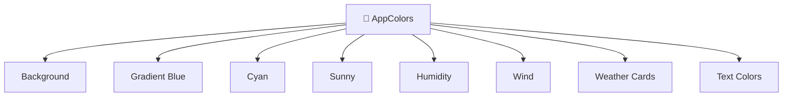

---

# 30. 🛠️ `utils/`

Folder:

```text
lib/utils/
```

Current file:

```text
constants.dart
```

The utils folder contains reusable application-level constants/utilities.

---

# 31. 🛠️ `constants.dart`

Location:

```text
lib/utils/constants.dart
```

Current constants include:

```text
appName
tagline
defaultCity
```

Example:

```text
appName = Weatherly
tagline = More Than Weather
defaultCity = Tilhar
```

---

# 32. 🛠️ Why Constants Exist

Instead of repeatedly writing:

```text
Weatherly
More Than Weather
Tilhar
```

the application can use:

```text
AppConstants.appName
AppConstants.tagline
AppConstants.defaultCity
```

This keeps commonly used values centralized.

---

# 33. 🧩 `widgets/`

Folder:

```text
lib/widgets/
```

Current reusable widgets:

```text
weather_info_card.dart
weather_stat.dart
```

These widgets contain UI components that can be reused by screens.

---

# 34. 🧩 `weather_info_card.dart`

Location:

```text
lib/widgets/weather_info_card.dart
```

This widget represents a reusable weather information card.

It accepts:

```text
icon
title
value
```

Conceptually:

```text
WeatherInfoCard
│
├── Icon
├── Title
└── Value
```

Example concept:

```text
💧
Humidity
70%
```

---

# 35. 🧩 `weather_stat.dart`

Location:

```text
lib/widgets/weather_stat.dart
```

This widget represents a reusable weather statistic.

It accepts:

```text
icon
title
value
iconColor
```

Conceptually:

```text
WeatherStat
│
├── Icon
├── Title
└── Value
```

---

# 36. 🧩 Reusable Widget Architecture

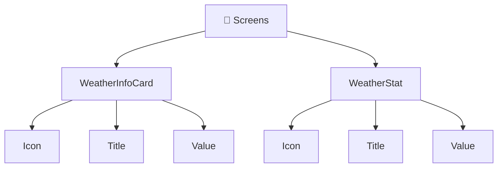

---

# 37. 🔗 Folder Responsibility Map

The easiest way to remember the folders:

```text
models/
    ↓
What data looks like

services/
    ↓
Where data comes from

screens/
    ↓
What user sees

navigation/
    ↓
How screens connect

widgets/
    ↓
Reusable UI components

theme/
    ↓
How application looks

utils/
    ↓
Shared constants/helpers
```

---

# 38. 🧠 Responsibility Diagram

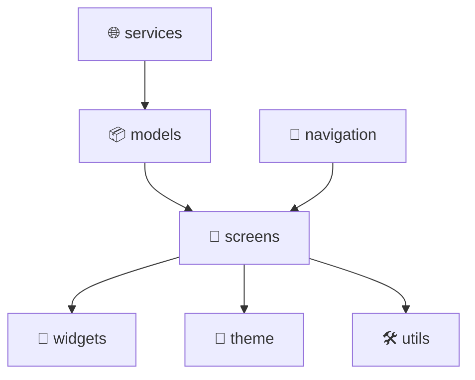

---

# 39. 🔄 Complete Data Flow Through Folders

When a user searches for a city:

```text
screens/
SearchScreen
      ↓
services/
WeatherService
      ↓
OpenWeather API
      ↓
services/
WeatherService
      ↓
models/
WeatherModel
      ↓
navigation/
MainNavigation
      ↓
screens/
HomeScreen
      ↓
widgets/
Weather UI
```

Mermaid:

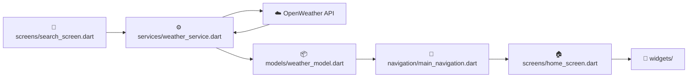

---

# 40. 🧭 Application Dependency Map

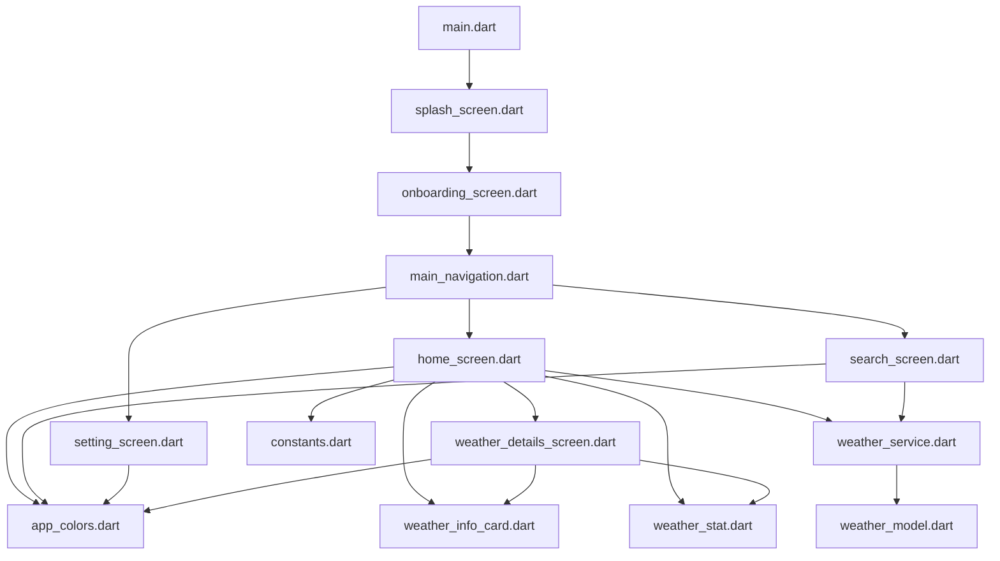

---

# 41. 🧩 File Responsibility Map

| File | Responsibility |
|---|---|
| `main.dart` | Application entry point |
| `splash_screen.dart` | Splash / branding |
| `onboarding_screen.dart` | First-time introduction |
| `main_navigation.dart` | Main tab navigation |
| `home_screen.dart` | Main weather UI |
| `search_screen.dart` | City search |
| `weather_details_screen.dart` | Detailed weather information |
| `setting_screen.dart` | Settings / app information |
| `weather_service.dart` | API communication |
| `weather_model.dart` | Weather data model |
| `app_colors.dart` | Centralized colors |
| `constants.dart` | Shared application constants |
| `weather_info_card.dart` | Reusable weather card |
| `weather_stat.dart` | Reusable weather statistic |

---

# 42. 🔌 Dependency Direction

The important dependency direction is:

```text
Screens
   ↓
Services
   ↓
External API
```

and:

```text
Services
   ↓
Models
   ↓
Screens
```

UI components are reused by screens:

```text
Screens
   ↓
Widgets
```

Design constants are used by screens/widgets:

```text
Theme
   ↓
Screens + Widgets
```

---

# 43. 🏗️ Simplified Architecture

Weatherly can be understood as:

```text
┌─────────────────────────────┐
│          📱 UI              │
│                             │
│  Screens + Reusable Widgets │
└──────────────┬──────────────┘
               │
               ↓
┌─────────────────────────────┐
│       🧭 Navigation         │
│                             │
│      MainNavigation         │
└──────────────┬──────────────┘
               │
               ↓
┌─────────────────────────────┐
│       ⚙️ Service            │
│                             │
│       WeatherService        │
└──────────────┬──────────────┘
               │
               ↓
┌─────────────────────────────┐
│       ☁️ External API       │
│                             │
│       OpenWeather           │
└─────────────────────────────┘
```

---

# 44. 🧠 Where Should You Make Changes?

If you want to...

### Change the weather API

Go to:

```text
lib/services/weather_service.dart
```

---

### Change weather data fields

Go to:

```text
lib/models/weather_model.dart
```

---

### Change Home UI

Go to:

```text
lib/screens/home_screen.dart
```

---

### Change Search UI

Go to:

```text
lib/screens/search_screen.dart
```

---

### Change Weather Details

Go to:

```text
lib/screens/weather_details_screen.dart
```

---

### Change Settings

Go to:

```text
lib/screens/setting_screen.dart
```

---

### Change colors

Go to:

```text
lib/theme/app_colors.dart
```

---

### Change app name/tagline/default city

Go to:

```text
lib/utils/constants.dart
```

---

### Change reusable weather components

Go to:

```text
lib/widgets/
```

---

### Change main tab navigation

Go to:

```text
lib/navigation/main_navigation.dart
```

---

### Change app startup

Go to:

```text
lib/main.dart
```

---

# 45. 🔍 ID Map

The following map gives every major project area a simple identifier.

```text
[APP]
    main.dart

[NAV]
    main_navigation.dart

[SCREEN]
    splash_screen.dart
    onboarding_screen.dart
    home_screen.dart
    search_screen.dart
    weather_details_screen.dart
    setting_screen.dart

[SERVICE]
    weather_service.dart

[MODEL]
    weather_model.dart

[THEME]
    app_colors.dart

[UTIL]
    constants.dart

[WIDGET]
    weather_info_card.dart
    weather_stat.dart
```

---

# 46. 🆔 Component ID Map

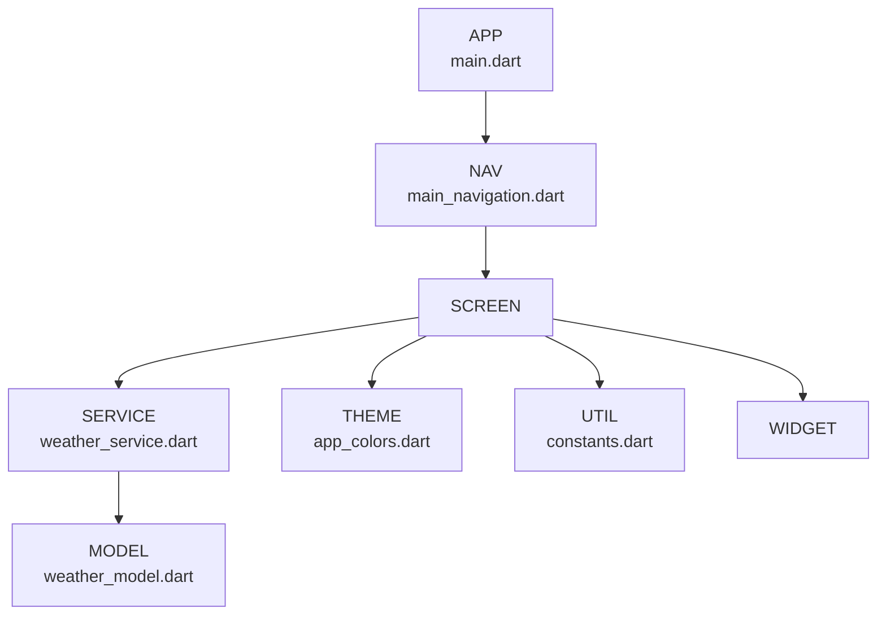

---

# 47. 🔄 Request Lifecycle

A complete request can be mapped across files:

```text
SEARCH SCREEN
      │
      │ getWeather(city)
      ↓
WEATHER SERVICE
      │
      │ http.get()
      ↓
OPENWEATHER API
      │
      │ JSON
      ↓
WEATHER SERVICE
      │
      │ WeatherModel
      ↓
MAIN NAVIGATION
      │
      │ selectedWeather
      ↓
HOME SCREEN
      │
      ↓
REUSABLE WIDGETS
      │
      ↓
USER
```

---

# 48. 🧠 Beginner Mental Model

If you are learning Flutter from scratch, remember the project like this:

```text
main.dart
    ↓
Starts the app

screens/
    ↓
Shows screens

navigation/
    ↓
Moves between screens

services/
    ↓
Talks to API

models/
    ↓
Stores structured data

widgets/
    ↓
Reusable UI

theme/
    ↓
Colors/design

utils/
    ↓
Shared constants
```

---

# 49. 🚀 How To Add a New Feature

Suppose you want to add:

```text
UV Index
```

A simple approach would be:

```text
1. Check API response
        ↓
2. Add field to WeatherModel
        ↓
3. Extract field in WeatherService
        ↓
4. Add UI in appropriate screen
        ↓
5. Reuse/create widget if needed
```

Example:

```text
WeatherModel
    ↓
uvIndex

WeatherService
    ↓
Extract UV data

HomeScreen / DetailsScreen
    ↓
Display UV

Widget
    ↓
Reusable UI
```

---

# 50. 🛠️ How To Add Another API

If another API is needed:

```text
lib/services/
```

could contain:

```text
weather_service.dart
news_service.dart
```

Models could contain:

```text
weather_model.dart
news_model.dart
```

This keeps different types of data separated.

---

# 51. 📈 How The Project Can Grow

Current project:

```text
lib/
├── models/
├── navigation/
├── screens/
├── services/
├── theme/
├── utils/
└── widgets/
```

As the project grows, more files can be added without putting everything into one folder.

For example:

```text
services/
├── weather_service.dart
├── news_service.dart
└── location_service.dart
```

and:

```text
models/
├── weather_model.dart
├── news_model.dart
└── location_model.dart
```

---

# 52. ⚠️ Important Project Rule

Do not put everything inside:

```text
main.dart
```

Instead:

```text
UI → screens/
API → services/
Data → models/
Reusable UI → widgets/
Colors → theme/
Constants → utils/
Navigation → navigation/
```

This makes the project easier to:

```text
Read
Debug
Maintain
Extend
Learn
```

---

# 53. 🎯 Final Architecture

The entire Weatherly project can be remembered with this diagram:

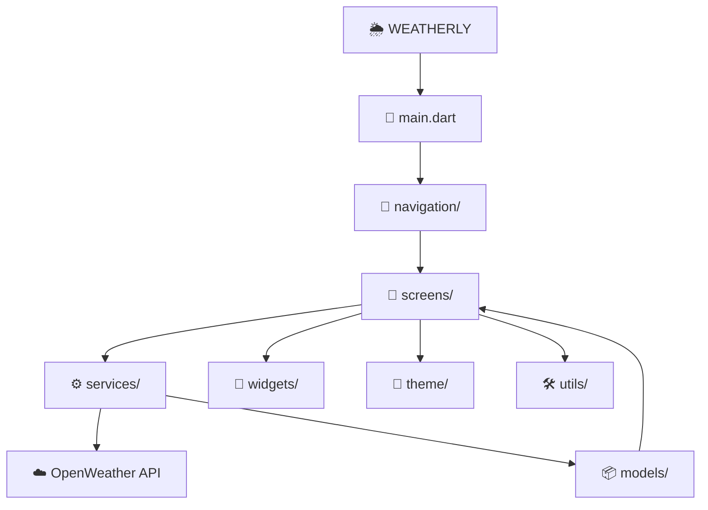

---

# 🌟 Final Takeaway

Weatherly follows a simple responsibility-based structure:

```text
                 WEATHERLY
                     │
        ┌────────────┼────────────┐
        ↓            ↓            ↓
      📱 UI        ⚙️ Logic     📦 Data
        │            │            │
    Screens       Services      Models
        │            │
    Widgets        API
        │
     Theme
        │
     Utils
```

The most important rule is:

```text
📱 Screens
    ↓
⚙️ Services
    ↓
☁️ API

⚙️ Services
    ↓
📦 Models
    ↓
📱 Screens
```

This structure keeps Weatherly understandable for a beginner while still giving the project a clean foundation for future development.

---

## 🌦️ Weatherly

> **More Than Weather**

Built with Flutter 💙