# ⚙️ Weatherly — Setup Guide

> Complete guide to set up, configure, run, test, and build the Weatherly Flutter application.

---

# 📌 1. Setup Overview

Weatherly ek Flutter weather application hai jo OpenWeather API se real-time weather data fetch karta hai.

Project ko run karne ke liye mainly ye cheezein required hain:

- Flutter SDK
- Dart SDK
- VS Code / Android Studio
- Android device or emulator
- Internet connection
- OpenWeather API key
- Required Flutter packages

### Setup Flow

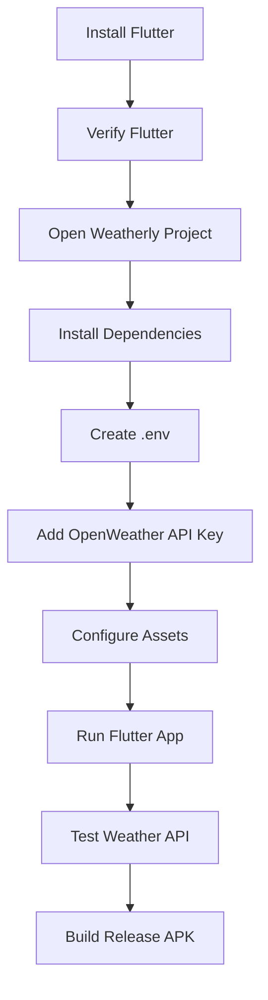

---

# 🆔 2. Setup ID Map

Setup process ko easily understand karne ke liye important parts ko IDs di gayi hain.

```text
[FLUTTER] Flutter SDK
[DART] Dart SDK
[EDITOR] VS Code / Android Studio
[DEVICE] Android Device / Emulator
[PKG] Flutter Packages
[ENV] .env Configuration
[API] OpenWeather API
[ASSET] Flutter Assets
[RUN] Development Run
[DEBUG] Debug Build
[RELEASE] Release Build
[ICON] App Icon Configuration
[GIT] Git Configuration
```

### Setup Dependency Map

```mermaid
flowchart LR

    [FLUTTER] --> [DART]
    [FLUTTER] --> [RUN]

    [PKG] --> [RUN]
    [ENV] --> [API]
    [API] --> [RUN]

    [DEVICE] --> [RUN]

    [ICON] --> [RELEASE]
    [GIT] --> [ENV]
```

---

# 🧰 3. Prerequisites

Before running Weatherly, make sure the development environment is ready.

---

## 3.1 Flutter SDK

Flutter SDK required hai because Weatherly Flutter application hai.

Verify installation:

```bash
flutter --version
```

Expected output mein Flutter version aur Dart version show hona chahiye.

---

## 3.2 Flutter Doctor

Flutter environment check karne ke liye:

```bash
flutter doctor
```

Ye command development environment ke important components check karti hai.

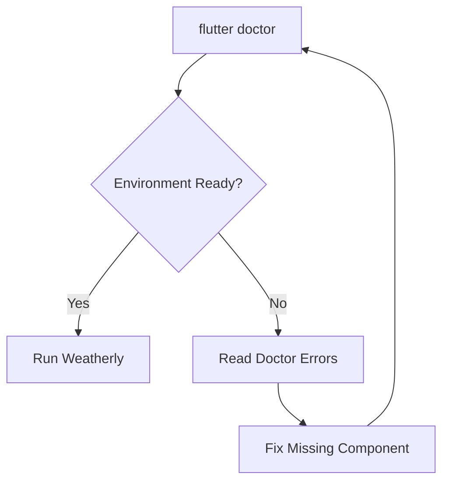

---

# 💻 4. Recommended Development Tools

Weatherly develop karne ke liye commonly:

```text
VS Code
Android Studio
Git
Flutter SDK
Chrome
Android Device / Emulator
```

### VS Code

VS Code coding ke liye use kiya ja sakta hai.

Useful extensions:

```text
Flutter
Dart
```

---

# 📱 5. Android Device Setup

Weatherly ko physical Android phone par test kiya ja sakta hai.

Phone mein:

```text
Settings
   ↓
Developer Options
   ↓
USB Debugging
   ↓
Enable
```

Phone ko USB cable se computer se connect karo.

Then:

```bash
flutter devices
```

Agar phone properly connected hai to device list mein show hona chahiye.

---

# 🤖 6. Android Emulator

Agar physical phone available nahi hai to Android Emulator use kar sakte ho.

Basic flow:

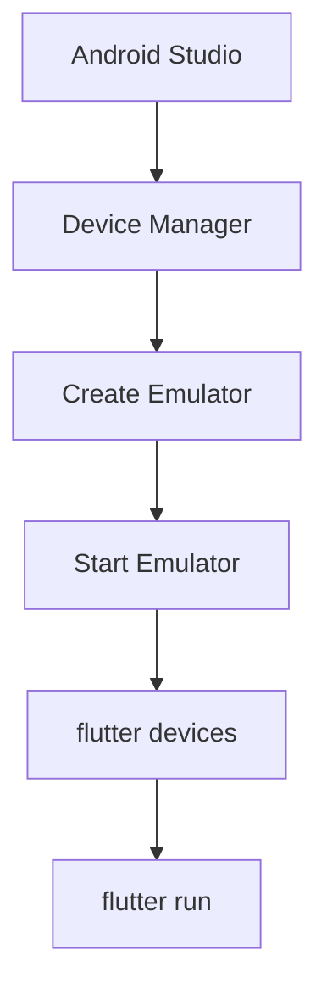

---

# 📂 7. Open Weatherly Project

Project folder open karo.

Expected structure:

```text
weatherly/
├── android/
├── assets/
│   └── icons/
├── lib/
├── test/
├── .env
├── .gitignore
├── pubspec.yaml
└── README.md
```

Important files:

```text
pubspec.yaml
.env
lib/main.dart
```

---

# 📦 8. Install Flutter Dependencies

Project folder ke andar terminal open karo.

Run:

```bash
flutter pub get
```

Ye `pubspec.yaml` mein defined dependencies install karta hai.

Weatherly ke important packages:

```text
http
flutter_dotenv
flutter_launcher_icons
```

---

# 🔗 9. Package Dependency Flow

Weatherly mein packages ka role:

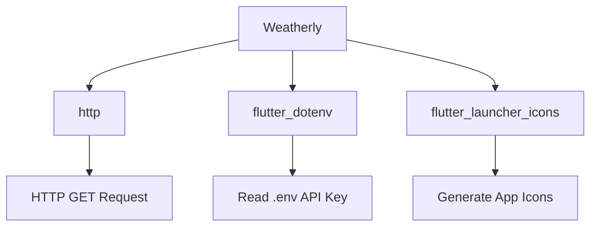

---

# 🌦️ 10. OpenWeather API Setup

Weatherly real weather data ke liye OpenWeather API use karta hai.

Basic data flow:

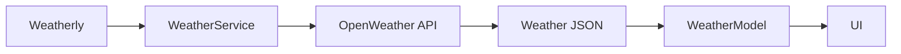

---

# 🔑 11. Create OpenWeather API Key

Weatherly ke API requests ke liye OpenWeather API key required hai.

OpenWeather account create karke API key obtain karo.

API key milne ke baad usse directly Dart code mein hard-code nahi karna.

Instead `.env` file use karo.

---

# 🔐 12. Create `.env`

Project root mein `.env` file create karo.

```text
weatherly/
├── .env
├── pubspec.yaml
├── lib/
└── ...
```

`.env` ke andar:

```env
OPENWEATHER_API_KEY=YOUR_REAL_API_KEY
```

Example:

```env
OPENWEATHER_API_KEY=abc123xxxxxxxx
```

> ⚠️ Actual API key ko GitHub, screenshots, README ya public source code mein share mat karo.

---

# 🧩 13. `.env` Configuration

`pubspec.yaml` mein `.env` asset ke roop mein add hona chahiye.

```yaml
flutter:
  uses-material-design: true
  assets:
    - .env
```

Agar app mein custom icon bhi use ho raha hai:

```yaml
flutter:
  uses-material-design: true

  assets:
    - .env
    - assets/icons/weatherly_icon.png
```

---

# 🔄 14. Environment Variable Flow

Weatherly mein API key ka flow:

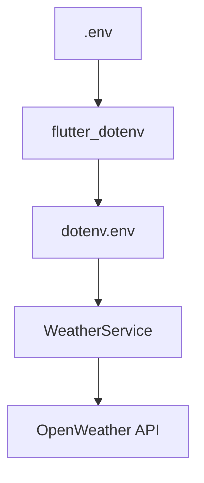

Code mein API key read hoti hai:

```dart
final apiKey = dotenv.env['OPENWEATHER_API_KEY'];
```

---

# 🚀 15. `.env` Load Karna

`main.dart` mein application start hone se pehle `.env` load hona chahiye.

Basic concept:

```dart
await dotenv.load(fileName: ".env");
```

Then app start hoti hai.

Flow:

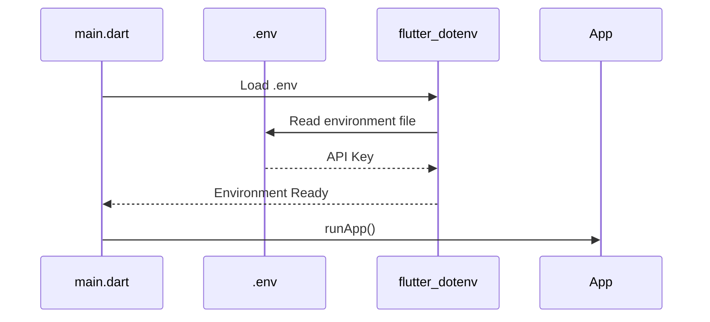

---

# 🛡️ 16. `.gitignore` Configuration

`.env` ko Git se ignore karna important hai.

`.gitignore` mein:

```gitignore
.env
```

Expected:

```text
Project
│
├── .env
├── .gitignore
└── pubspec.yaml
```

Git flow:

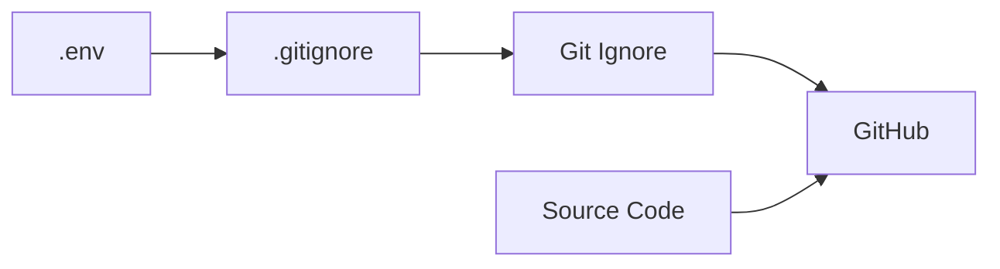

Result:

```text
.env
  ↓
Git ignores it
  ↓
API key GitHub par push nahi hoti
```

> ⚠️ Important: `.env` ko GitHub se hide karna API key ko mobile app ke compiled APK se completely secret nahi banata. Production apps mein public-client API keys ke liye proper API security/rules consider karne chahiye.

---

# 🧪 17. Run Weatherly

Dependencies install karne ke baad:

```bash
flutter run
```

Agar multiple devices connected hain:

```bash
flutter devices
```

Specific device select karke run kiya ja sakta hai.

---

# ▶️ 18. Development Run Flow

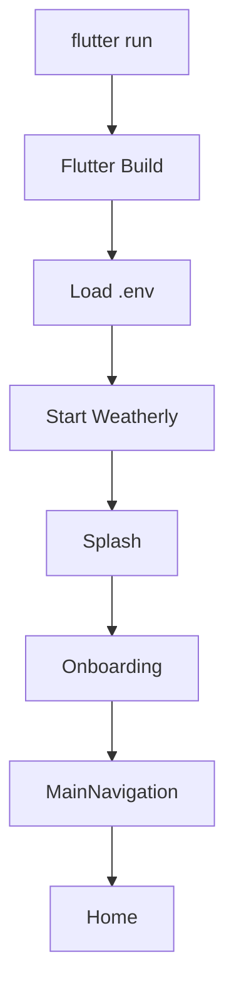

---

# 🌐 19. Running on Chrome

Weatherly ko Chrome par bhi run kiya ja sakta hai if web support configured hai.

```bash
flutter run -d chrome
```

Available devices check:

```bash
flutter devices
```

---

# 🧪 20. Testing Weather API

App start hone ke baad default city weather load hona chahiye.

Current default flow:

```text
Weatherly
   ↓
HomeScreen
   ↓
Default City
   ↓
WeatherService
   ↓
OpenWeather API
   ↓
WeatherModel
   ↓
Weather UI
```

---

# 🔍 21. Search Testing

Search Screen open karo.

Example:

```text
Tilhar
Bareilly
New Delhi
Mumbai
```

Flow:

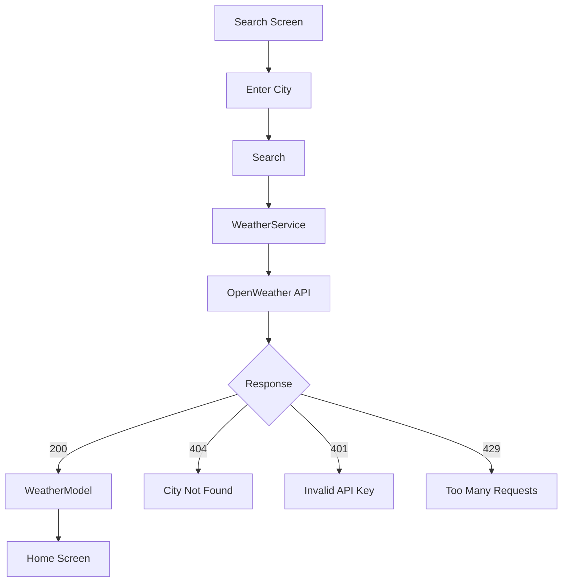

---

# ❌ 22. Common `.env` Problems

## Problem 1 — `.env` not found

Possible reason:

```text
.env file missing
```

Check:

```text
weatherly/
├── .env
└── pubspec.yaml
```

---

## Problem 2 — API key null

Check:

```env
OPENWEATHER_API_KEY=YOUR_REAL_API_KEY
```

And:

```yaml
assets:
  - .env
```

---

## Problem 3 — API key invalid

WeatherService mein API response:

```text
401
```

Agar 401 mil raha hai to API key configuration check karo.

---

# 🌐 23. Android Internet Permission

Agar Android **release build** mein API/network request work nahi kar rahi ho, to Android internet permission check karo.

File:

```text
android/app/src/main/AndroidManifest.xml
```

Manifest ke andar:

```xml
<manifest xmlns:android="http://schemas.android.com/apk/res/android">

    <uses-permission android:name="android.permission.INTERNET"/>

    <application
        android:label="Weatherly"
        android:name="${applicationName}"
        android:icon="@mipmap/ic_launcher">

        ...
        
    </application>

</manifest>
```

Important location:

```text
<manifest>
    ↓
<uses-permission>
    ↓
<application>
```

---

# 🧠 24. Debug vs Release

Development mein:

```bash
flutter run
```

usually debug build run karta hai.

Release APK ke liye:

```bash
flutter build apk --release
```

Difference:

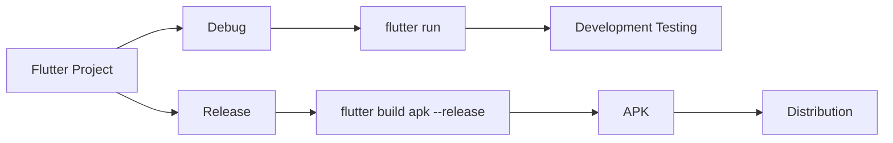

---

# 🧹 25. Clean Build

Agar Flutter build weird behave kar raha hai:

```bash
flutter clean
```

Then:

```bash
flutter pub get
```

Then:

```bash
flutter run
```

Complete sequence:

```bash
flutter clean
flutter pub get
flutter run
```

---

# 📱 26. Build Release APK

Release APK generate karne ke liye:

```bash
flutter clean
flutter pub get
flutter build apk --release
```

APK normally yahan generate hoti hai:

```text
build/app/outputs/flutter-apk/app-release.apk
```

---

# 📦 27. Release Build Flow

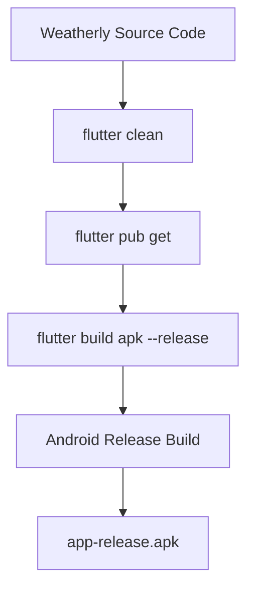

---

# 🌍 28. Build Android App Bundle

Play Store distribution ke liye Android App Bundle generate kiya ja sakta hai:

```bash
flutter build appbundle --release
```

Output generally:

```text
build/app/outputs/bundle/release/
```

---

# 🎨 29. App Icon Setup

Weatherly custom launcher icon use karta hai.

Asset:

```text
assets/
└── icons/
    └── weatherly_icon.png
```

`pubspec.yaml` mein icon package configuration:

```yaml
flutter_launcher_icons:
  android: true
  ios: false
  web:
    generate: true
    image_path: "assets/icons/weatherly_icon.png"
    background_color: "#061B33"
    theme_color: "#0D4773"
  image_path: "assets/icons/weatherly_icon.png"
  min_sdk_android: 21
```

---

# 🪄 30. Generate Launcher Icons

Run:

```bash
dart run flutter_launcher_icons
```

Flow:

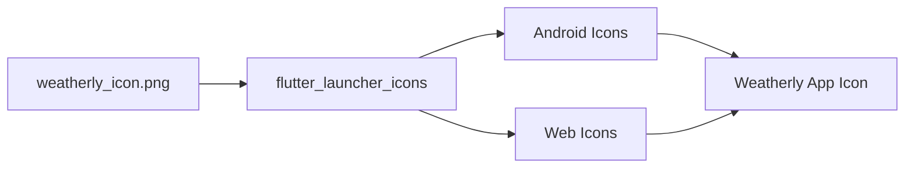

---

# 🧹 31. Icon Changes Not Showing?

If old icon still appears:

```bash
flutter clean
flutter pub get
dart run flutter_launcher_icons
flutter build apk --release
```

Then uninstall old APK from device and install the new APK if necessary.

---

# 🛠️ 32. Troubleshooting Decision Tree

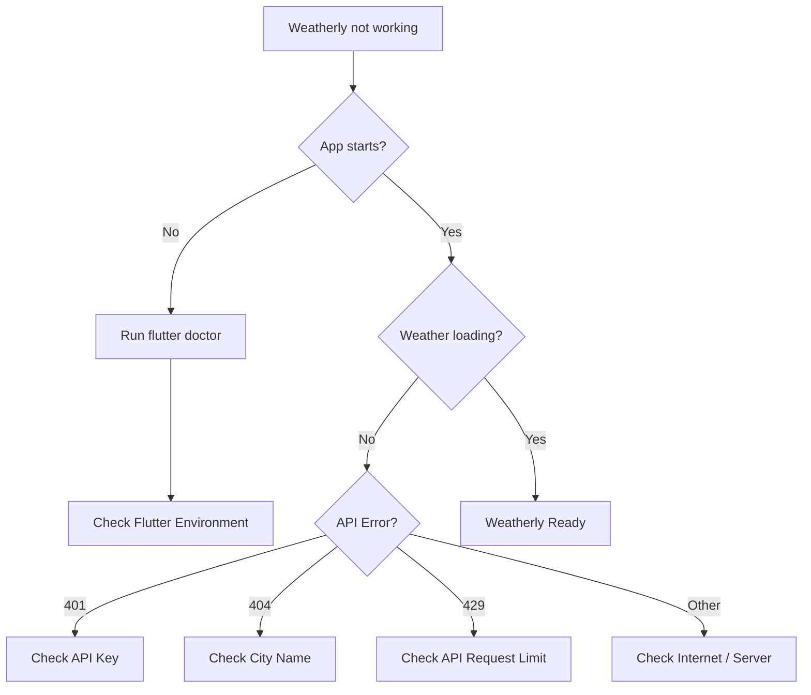

---

# 🧯 33. Common Flutter Commands

### Check Flutter

```bash
flutter --version
```

### Check Environment

```bash
flutter doctor
```

### Check Devices

```bash
flutter devices
```

### Install Dependencies

```bash
flutter pub get
```

### Run App

```bash
flutter run
```

### Run Chrome

```bash
flutter run -d chrome
```

### Clean Project

```bash
flutter clean
```

### Generate Launcher Icons

```bash
dart run flutter_launcher_icons
```

### Build APK

```bash
flutter build apk --release
```

### Build App Bundle

```bash
flutter build appbundle --release
```

---

# 🧭 34. Complete Setup Checklist

Before considering the setup complete, verify:

```text
[ ] Flutter installed
[ ] flutter doctor checked
[ ] Android device/emulator available
[ ] Weatherly project opened
[ ] flutter pub get completed
[ ] .env created
[ ] OPENWEATHER_API_KEY added
[ ] .env added to pubspec assets
[ ] .env added to .gitignore
[ ] Internet permission checked
[ ] flutter run successful
[ ] Home weather loads
[ ] Search works
[ ] Invalid city handling works
[ ] Weather details work
[ ] Custom app icon generated
[ ] Release APK builds successfully
```

---

# 🏁 35. Complete First-Time Setup

A fresh setup can be summarized as:

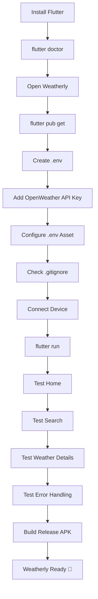

---

# 🧠 36. Developer Mental Model

Weatherly setup ko simple way mein yaad rakho:

```text
Flutter
   ↓
Project
   ↓
Packages
   ↓
.env
   ↓
API Key
   ↓
OpenWeather
   ↓
Run
   ↓
Test
   ↓
Build
```

Ya aur short:

```text
INSTALL
   ↓
CONFIGURE
   ↓
RUN
   ↓
TEST
   ↓
BUILD
```

---

# 🆔 37. Final Setup ID Map

```text
[FLUTTER]
Flutter SDK
        ↓
[PKG]
Dependencies
        ↓
[ENV]
.env + API Key
        ↓
[API]
OpenWeather
        ↓
[RUN]
flutter run
        ↓
[DEBUG]
Development Testing
        ↓
[ICON]
Launcher Icon
        ↓
[RELEASE]
Release APK / AAB
```

---

# 📌 38. Setup Files Responsibility

| File / Folder | Responsibility |
|---|---|
| `.env` | OpenWeather API key |
| `.gitignore` | Sensitive/local files ko Git se ignore karna |
| `pubspec.yaml` | Packages + assets + project configuration |
| `lib/main.dart` | App startup |
| `android/app/src/main/AndroidManifest.xml` | Android app configuration |
| `assets/icons/` | App icon assets |
| `android/` | Android platform configuration |
| `build/` | Generated build files |

---

# 🎯 39. Setup Complete

Agar following command successfully run ho jaye:

```bash
flutter run
```

aur Weatherly:

```text
Splash
   ↓
Onboarding
   ↓
Home
   ↓
Weather Data
   ↓
Search
   ↓
Details
   ↓
Settings
```

properly work kare, to local development setup complete hai.

Release APK ke liye:

```bash
flutter build apk --release
```

Aur Play Store-style Android distribution ke liye:

```bash
flutter build appbundle --release
```

---

## 🚀 Weatherly Setup Principle

> **A good setup means the project can be cloned, configured, run, tested, and built without modifying the application logic.**

The goal of this setup is not just to make Weatherly run on one machine.

The goal is to make the project **reproducible for another developer**.